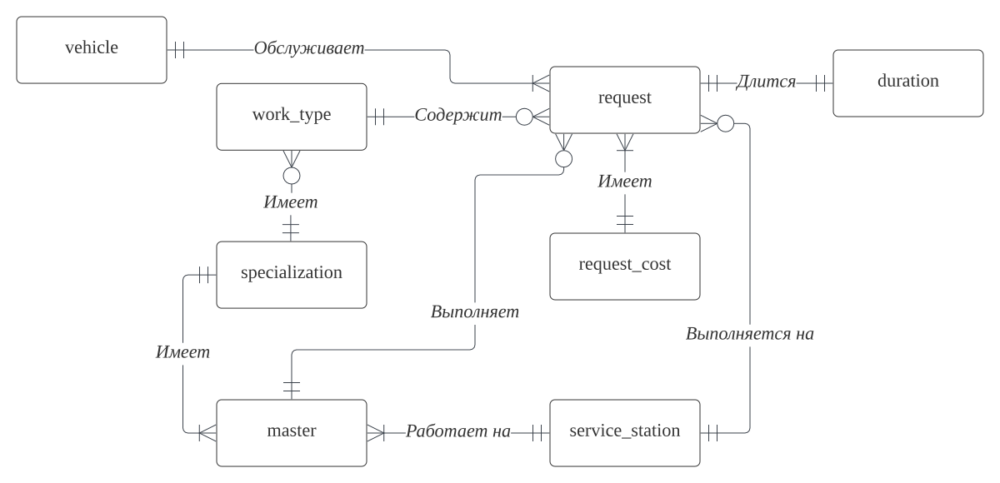
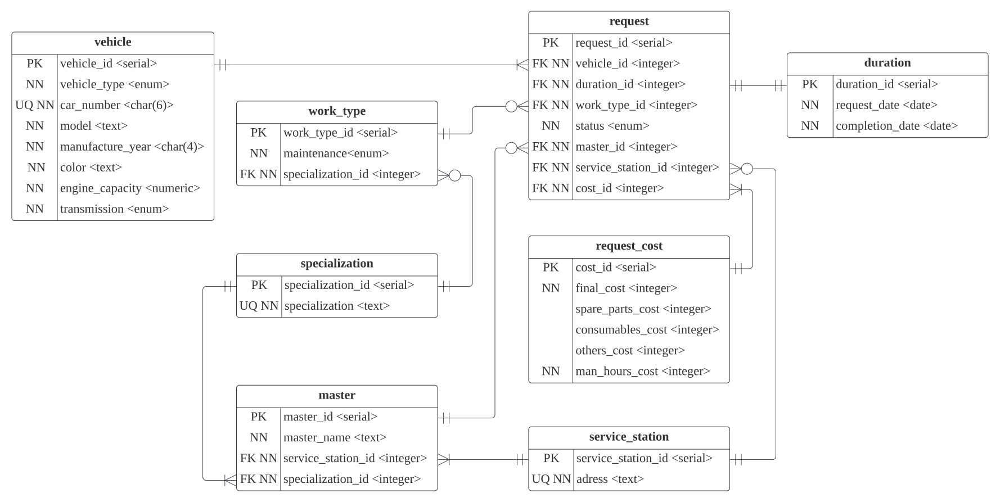

# Лабораторная работа 1.1: Разработка структуры БД

## Цели работы

Познакомиться с основами проектирования схемы БД, способами организации данных в SQL-БД.

## Программа работы:
1. Создание проекта для работы в GitLab.
2. Выбор задания (предметной области), описание набора данных и требований к хранимым данным в свободном формате в wiki своего проекта в GitLab.
3. Формирование в свободном формате (предпочтительно в виде графической схемы) cхемы БД, соответствующей заданию. Должно получиться не менее 7 таблиц.
4. Согласование с преподавателем схемы БД. Обоснование принятых решений и соответствия требованиям выбранного задания.
5. Выкладывание схемы БД в свой проект в GitLab.
6. Демонстрация результатов преподавателю.


## Ход работы:
#### 1. Создание проекта для работы в GitLab
Для выполнения курса лабораторных работ в GitLab был создан [проект](https://gitlab.icc.spbstu.ru/frid.za/database).


#### 2. Выбор задания (предметной области), описание набора данных и требований к хранимым данным в свободном формате в wiki своего проекта в GitLab.
В ходе выполнения данного проект будет реализована база данных для сети станций технического обслуживания транспортных средств.
Эта база данных должна содержать информацию об обращениях на СТО, обслуживаемых ТС, мастерах, их специализации, о типе работ, выполняемых на СТО, о самих станциях технического обслуживания, о продолжительности работ, текущем статусе и стоимости.

#### Таблицы:

**request** - обращение на СТО. 
```
- resuest_id (номер обращения)
- vechile_id (id транспортного средства)
- duration_id (id срока работы)
- work_type_id (id типа работ)
- status (статус обращения)
- master_id (id мастера)
- sevice_station_id (id станции ТО)
- cost_id (id стоимости)
```

**vehiсle** - транспортное средство. 
```
- vechicle_id (номер ТС)
- vehicle_type (тип транспортного средства)
- car_number (регистрационный номер)
- model (марка и модель)
- manufacture_year (год выпуска)
- color (цвет)
- engine_capacity (объем двигателя)
- transmission (коробка передач)
```

**master** - мастер по обслуживанию.
```
- master_id (номер мастера)
- master_name (имя мастера)
- service_station_id (id станции ТО)
- specialization_id (id специализации)
```

**specialization** - специализация работы
```
- specialization_id (номер специализации)
- specialization (расшифровка специализации)
```

**work_type** - тип работ.
```
- work_type_id (номер типа работ)
- maintenance (вид тех. обслуживания, ex., плановое или аварийное)
- specialization_id (id специализации)
```

**service_station** - станция ТО
```
- service_station_id (номер станции ТО)
- address (адрес)
```

**duration** - срок работы.
```
- duration_id (номер срока  работ)
- request_date (дата обращения)
- completion_date (дата завершения)
```

**request_cost** - стоимость работы.
```
- cost_id (номер стоимости работ)
- final_cost (итоговая стоимость)
- spare_parts_cost (стоимость запчастей)
- consumable_cost (стоимость расходных материалов)
- others_cost (стоимость прочего)
- man_hours_cost (стоимость человекочасов)
```

#### 3. Формирование в свободном формате (предпочтительно в виде графической схемы) cхемы БД, соответствующей заданию. Должно получиться не менее 7 таблиц.

Для выделения ключевых сущностей и обозначения связей, которые могут устанавливаться между этими сущностями, была создана концептуальная модель БД. 




*Пояснение связей*

Обращение обслуживает транспортное средство. Обращение длится некоторый период времени. Обращение содержит тип работы. Обращение выполняется на СТО. Обращение имеет стоимость.
Мастер выполняет обращение, работает на СТО, имеет специализацию.
Тип работы имеет специализацию. 


Даталогическая модель — набор схем отношений, обычно с указанием первичных ключей, а также «связей» между отношениями, представляющих собой внешние ключи.

Была составлена даталогическая модель выбраной БД.




*Пояснение связей*
- Обращение длится некоторый период времени, связь один к одному, так как за каждым сроком работы закрепляется только одно обращение; обращение имеет стоимость, связь один ко многим, потому что одно обращение имеет одну стимость и при этом одна стоимость может быть у разных обращений.
- Обращение выполняется на СТО. Несколько СТО не могут одновремнно выполнять одно обращение. На любой СТО может не выполняться никаких обращений или может выполняться несколько обращений.
- Обращение выполняется мастером. Несколько мастеров не могут работать над одним обращением, но один мастер может выполнять много обращений или не выполнять ни одного.
- Мастер работает на станции ТО. Он не может работать на нескольких СТО, но на каждой СТО должен работать как минимум один мастер.
- Мастер имеет специализацию. Он не может иметь несколько специализаций. Мастеров некоторой специализации должно быть как минимум один и при этом, несколько мастеров могут иметь одну специализацию. 
- Оращение содержит тип работы. В одном обращении может быть только один тип работы, при этом некоторые типы работ могут не присутствовать в каких-либо обращениях (например, новые услуги только появились, или тип работы не очень популярен).
- Тип работы имеет одну специализацию, но при этом специализация может не принадлежать ни к одному типу работ (только наняли работника).
- Обращение обсуживает одно транспортное средство. Любое ТС может быть в одном или нескольких обращениях. Считает, что информация о ТС заносится при первом обращении.

#### 4. Согласование с преподавателем схемы БД. Обоснование принятых решений и соответствия требованиям выбранного задания.

Схема была согласова с преподавателем и одобрена.

#### 5. Выкладывание схемы БД в свой проект в GitLab.

Схемы были вылажены в упомянутый выше проект в GitLab.

#### 6. Демонстрация результатов преподавателю.

Результаты были продемонстрированны преподавателю.


## Вывод
При выполнении данной лабораторной работы был описан набор используемых таблиц и их структура.

При формировании диаграмм сначала была создана концептуальная модель БД, которая соответствует более высокому уровлю абстрации, отображает основные сущности и связи между ними.
Затем была составлена датологическая модель БД, в которой указаны первичные ключи и связи между отношениями с помощью внешних ключей.

