# Лабораторная работа 1.2: Язык SQL DDL

## Цели работы

Познакомиться с основами проектирования схемы БД, языком описания сущностей и ограничений БД SQL-DDL.

## Программа работы:
1. Самостоятельное изучение SQL-DDL.
2. Создание скрипта БД в соответствии с согласованной схемой. Должны присутствовать первичные и внешние ключи, ограничения на диапазоны значений. Демонстрация скрипта преподавателю.
3. Создание скрипта, заполняющего все таблицы БД данными.
4. Выполнение SQL-запросов, изменяющих схему созданной БД по заданию преподавателя. Демонстрация их работы преподавателю.


## Ход работы:
#### 1. Самостоятельное изучение SQL-DDL.

*Язык SQL (Structured Query Language)* - язык структурированных запросов. Он позволяет формировать весьма сложные запросы к базам данных. В SQL определены два подмножества языка:

- SQL-DDL (Data Definition Language) - язык определения структур и ограничений целостности баз данных. Сюда относятся команды создания и удаления баз данных; создания, изменения и удаления таблиц; управления пользователями и т.д.
- SQL-DML (Data Manipulation Language) - язык манипулирования данными: добавление, изменение, удаление и извлечение данных, управления транзакциями

В ходе выполнения работы использовался postgreSQL 14.

#### 2. Создание скрипта БД в соответствии с согласованной схемой.

Перейдем к созданию таблиц.

```sql
-- Перечисления для типа кузова и трансмиссии
create type body as enum ('Седан', 'Хэтчбек', 'Пикап', 'Микро', 'Кроссовер', 'Внедорожник', 'Кабриолет', 'Суперкар', 'Фургон', 'Купе', 'Грузовик', 'Минивен');
create type transmission_type as enum ('Механическая', 'Автоматическая', 'Полуавтоматическая');

-- Транспортное средство
CREATE TABLE IF NOT EXISTS vehicle
(
	vehicle_id SERIAL PRIMARY KEY,
	vehicle_type body NOT NULL,
	car_number CHAR(6) UNIQUE NOT NULL,
	model TEXT NOT NULL,
	manufacture_year CHAR(4) NOT NULL,
	color TEXT NOT NULL,
	engine_capacity NUMERIC(2, 1) NOT NULL,
	transmission transmission_type NOT NULL
);

```
Детальная информация о типах данных и прочнем взята с [этого](https://metanit.com/sql/postgresql/2.3.php) сайта.

Для создания таблиц применяется команда `CREATE TABLE`, после которой указывается название таблицы. Также с этой командой можно использовать ряд операторов, которые определяют столбцы таблицы и их атрибуты. 
Ключевые слова `IF NOT EXISTS` используются  для того, чтобы не возникала ошибка, если указанная таблица уже существует. Следует учитывать, что при этом не проверяется идентичность структур этих таблиц.

Используемые типы данных:

`SERIAL`: представляет автоинкрементирующееся числовое значение, которое занимает 4 байта и может хранить числа от 1 до 2147483647. Значение данного типа образуется путем автоинкремента значения предыдущей строки. Поэтому, как правило, данный тип используется для определения идентификаторов строки.

`CHAR(n)`: представляет строку из фиксированного количества символов. С помощью параметра задается задается количество символов в строке.

`TEXT`: представляет текст произвольной длины.

`NUMERIC(p, s)`: хранит числа с фиксированной точностью, которые могут иметь до 131072 знаков в целой части и до 16383 знаков после запятой.
Данный тип может принимать два параметра `precision` и `scale`: `numeric(precision, scale)`. Параметр `precision` указывает на максимальное количество цифр, которые может хранить число. Параметр `scale` представляет максимальное количество цифр, которые может содержать число после запятой. Это значение должно находиться в диапазоне от 0 до значения параметра `precision`. По умолчанию оно равно 0.

Так же был использован составной тип данных `enum`. PostgreSQL имеет специальный тип данных, который называется `enum` и который представляет набор констант. И столбец подобного типа может в качестве значения принимать одну из этих констант.


При определении таблиц и их столбцов в SQL мы можем использовать ряд атрибутов, которые накладывают определенные ограничения.
С помощью выражения `PRIMARY KEY` столбец можно сделать первичным ключом. Первичный ключ уникально идентифицирует строку в таблице. В качестве первичного ключа необязательно должны выступать столбцы с типом `SERIAL`, они могут представлять любой другой тип.
Если мы хотим, чтобы столбец имел только уникальные значения, то для него можно определить атрибут `UNIQUE`.
Чтобы указать, может ли столбец принимать значение `NULL`, при определении столбца ему можно задать атрибут `NULL` или `NOT NULL`. Если этот атрибут явным образом не будет использован, то по умолчанию столбец будет допускать значение `NULL`. Исключением является тот случай, когда столбец выступает в роли первичного ключа - в этом случае по умолчанию столбец имеет значение `NOT NULL`.


```sql
-- Специализация
CREATE TABLE IF NOT EXISTS specialization
(
	specialization_id SERIAL PRIMARY KEY,
	specialization TEXT UNIQUE NOT NULL
);
```

```sql
-- Стоимость
CREATE TABLE IF NOT EXISTS request_cost
(
	cost_id SERIAL PRIMARY KEY,
	final_cost INTEGER NOT NULL,
	spare_parts_cost INTEGER DEFAULT 0,
	consumable_cost INTEGER DEFAULT 0,
	others_cost INTEGER DEFAULT 0,
	man_hours_cost INTEGER NOT NULL
);
```
`INTEGER`: хранит числа от -2147483648 до +2147483647. Занимает 4 байта.

Атрибут `DEFAULT` определяет значение по умолчанию для столбца. Если при добавлении данных для столбца не будет предусмотрено значение, то для него будет использоваться значение по умолчанию.


```sql
-- Станция ТО
CREATE TABLE IF NOT EXISTS service_station
(
	service_station_id SERIAL PRIMARY KEY,
	address TEXT UNIQUE NOT NULL
);
```

```sql
-- Мастер
CREATE TABLE IF NOT EXISTS master
(
	master_id SERIAL PRIMARY KEY,
	master_name TEXT NOT NULL,
	service_station_id INTEGER REFERENCES service_station (service_station_id) NOT NULL,
	specialization_id INTEGER REFERENCES specialization (specialization_id) NOT NULL
);
```

Для связи между таблицами применяются внешние ключи. Внешний ключ устанавливается для столбца из зависимой, подчиненной таблицы (referencing table), и указывает на один из столбцов из главной таблицы (referenced table). Как правило, внешний ключ указывает на первичный ключ из связанной главной таблицы.
Чтобы установить связь между таблицами, после ключевого слова `REFERENCES` указывается имя связанной таблицы и далее в скобках имя столбца из этой таблицы, на который будет указывать внешний ключ. 

```sql
-- Перечисление для типа ТО
create type maintenance_type as enum ('Плановое', 'Аварийное');

-- Тип работ
CREATE TABLE IF NOT EXISTS work_type
(
	work_type_id SERIAL PRIMARY KEY,
	maintenance maintenance_type NOT NULL,
	specialization_id INTEGER REFERENCES specialization (specialization_id) NOT NULL
);
```

```sql
-- Срок работ
CREATE TABLE IF NOT EXISTS duration
(
	duration_id SERIAL PRIMARY KEY,
	request_date DATE NOT NULL,
	completion_date DATE NOT NULL
);
```

`DATE`: представляет дату от 4713 г. до н.э. до 5874897 г н.э. Занимает 4 байта.


```sql
-- Пречисление для статуса
create type request_status as enum ('Поступило', 'В работе', 'Ожидает', 'Готово', 'Завершено');

-- Обращение
CREATE TABLE IF NOT EXISTS request
(
	request_id SERIAL PRIMARY KEY,
	vehicle_id INTEGER REFERENCES vehicle (vehicle_id) NOT NULL,
	duration_id INTEGER REFERENCES duration (duration_id) NOT NULL,
	work_type_id INTEGER REFERENCES work_type (work_type_id) ON DELETE RESTRICT NOT NULL,
	status request_status NOT NULL,
	master_id INTEGER REFERENCES master (master_id) ON DELETE RESTRICT NOT NULL,		
	service_station_id INTEGER REFERENCES service_station (service_station_id) ON DELETE RESTRICT NOT NULL,
	cost_id INTEGER REFERENCES request_cost (cost_id) NOT NULL
); 
```

После выражения `REFERENCES` может идти выражение `ON DELETE` и `ON UPDATE`, которые уточняют поведение при удалении или обновлении данных.
С помощью выражений `ON DELETE` и `ON UPDATE` можно установить действия, которые выполняются соответственно при удалении и изменении связанной строки из главной таблицы.

Я хочу, чтобы в таблице обращений при закрыти СТО, увольнении мастера или удалении типа работы информации не удалялась, поэтому использую `RESTRICT`.

`RESTRICT`: предотвращает какие-либо действия в зависимой таблице при удалении или изменении связанных строк в главной таблице. То есть фактически какие-либо действия отсутствуют.

**Полученная схема:**
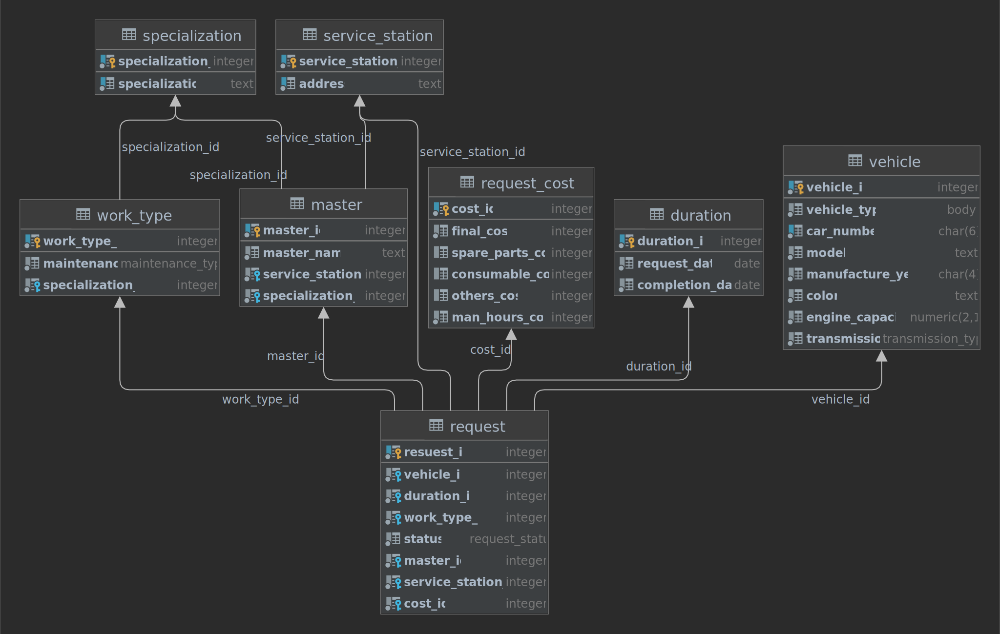


#### 3. Создание скрипта, заполняющего все таблицы БД данными.

Для добавления данных применяется команда `INSERT`. После `INSERT INTO` идет имя таблицы, затем в скобках указываются все столбцы через запятую, в которые надо добавлять данные. И в конце после слова `VALUES` в скобках перечисляются добавляемые значения.
Для извлечения данных из БД применяется команда `SELECT`. `SELECT * FROM имя_таблицы` позволяет получить все объектыиз этой таблицы. Символ звездочка `*` указывает, что нам надо получить все столбцы.

```sql
INSERT INTO vehicle (vehicle_type, car_number, model, manufacture_year, color, engine_capacity, transmission)
VALUES 
('Хэтчбек', 'B456CO', 'Nissan Tiida', '2010', 'черный', 1.6, 'Автоматическая'),
('Седан', 'M777OX', 'LADA (ВАЗ) Priora', '2008', 'фиолетовый', 1.6, 'Механическая'),
('Внедорожник', 'E666KX', 'Porsche Cayenne', '2019', 'белый', 3.0, 'Автоматическая'),
('Купе', 'A111AA', 'Lamborghini Murcielago', '2008', 'красный', 6.5, 'Полуавтоматическая'),
('Пикап', 'P825OM', 'Toyota Tundra', '2019', 'голубой', 5.7, 'Автоматическая');

	
SELECT * FROM vehicle;
```
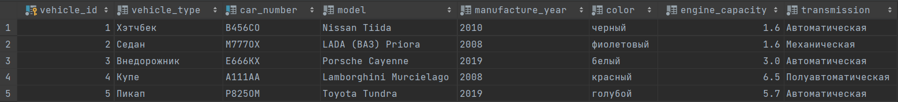


```sql
INSERT INTO specialization (specialization)
VALUES 
('Кузовной ремонт'),
('Электрика'),
('Автоматика'),
('Замена расходных материалов'),
('Ремонт двигателя'),
('Ремонт ходовой части');

SELECT * FROM specialization;
```
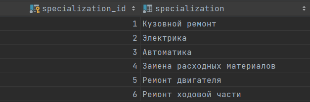


```sql
INSERT INTO request_cost (final_cost, spare_parts_cost, consumable_cost, others_cost, man_hours_cost)
VALUES
(6000, 3500, 0, 1500, 1000),
(5000, 3000, 0, 500, 1500),
(37000, 20000, 8000, 4000, 5000),
(76000, 60000, 10000, 0, 6000),
(5000, 0, 3000, 1000, 1000),
(7000, 0, 5000, 1000, 1000);

SELECT * FROM request_cost;
```
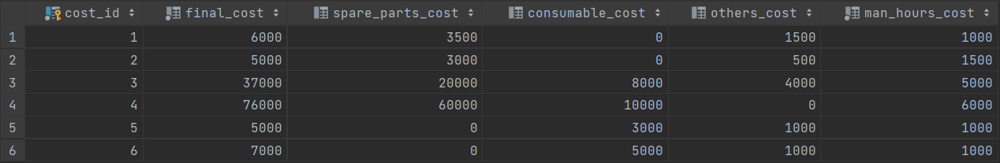


```sql
INSERT INTO service_station (address)
VALUES
('ул. Ленина, 15'),
('пр-кт Маршала Жукова, 43');

SELECT * FROM service_station;
```


```sql
INSERT INTO master (master_name, service_station_id, specialization_id)
VALUES
('Никита', 1, 6),
('Вадим', 1, 4),
('Евгений', 2, 3),
('Константин', 2, 2),
('Дмитрий', 2, 5);

SELECT * FROM master;
```
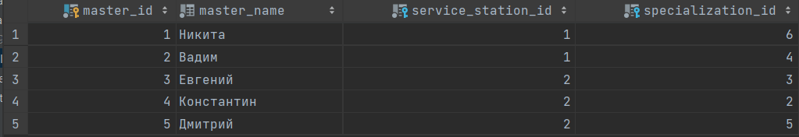


```sql
INSERT INTO work_type (maintenance, specialization_id)
VALUES
('Аварийное', 6),
('Аварийное', 2),
('Плановое', 3),
('Аварийное', 5),
('Плановое', 4);

SELECT * FROM work_type;
```
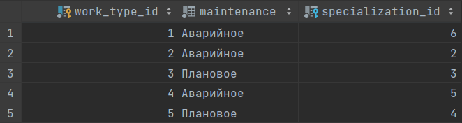

```sql
INSERT INTO duration (request_date, completion_date)
VALUES
('2022-03-22', '2022-03-28'),
('2022-03-25', '2022-03-30'),
('2022-03-27', '2022-04-03'),
('2022-03-28', '2022-04-15'),
('2022-04-01', '2022-04-07'),
('2022-04-05', '2022-04-10');

SELECT * FROM duration;
```

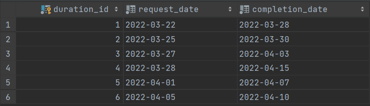


```sql

INSERT INTO request (vehicle_id, duration_id, work_type_id, status, master_id, service_station_id, cost_id)
VALUES
(1, 1, 1, 'Завершено', 1, 1, 1),
(2, 2, 2, 'Завершено', 4, 2, 2),
(3, 3, 3, 'Готово', 3, 2, 3),
(4, 4, 4, 'Ожидает', 5, 2, 4),
(5, 5, 5, 'Поступило', 2, 1, 5),
(1, 6, 5, 'Поступило', 2, 1, 6);

SELECT * FROM request;

```
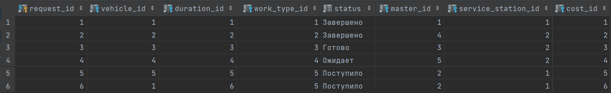


#### 4. Выполнение SQL-запросов, изменяющих схему созданной БД по заданию преподавателя. Демонстрация их работы преподавателю.

Задание: добавить таблицу (или таблицы), в которой будет храниться информация о `consumables` и `spare_parts` (те, чья стоимость хранится в таблице  `request_cost`), которые есть в наличии, и связать с обращениями, где эти позиции требуются (с указанием требуемого количества).

Создадим таблицу, которая хранит наименование различных запчастей и факт их наличия/отсутствия.
```sql
-- Запчасти
CREATE TABLE IF NOT EXISTS spare_parts 
(
	part_id SERIAL PRIMARY KEY,
	part_name TEXT UNIQUE NOT NULL,
	part_in_stock BOOLEAN NOT NULL
);
```

Создадим таблицу для связи обращений и требуемых запчастех, так же таблица хранит их необходимое количество для обращения.
```sql
-- Запчасти в обращениях
CREATE TABLE IF NOT EXISTS parts_for_request 
(
	request_id INTEGER REFERENCES request (request_id) NOT NULL,
	part_id INTEGER REFERENCES spare_parts (part_id) NOT NULL,
	part_amount INTEGER NOT NULL CHECK(part_amount > 0),
	PRIMARY KEY (request_id, part_id)
);
```
Ключевое слово `CHECK` задает ограничение для диапазона значений, которые могут храниться в столбце. Для этого после слова `CHECK` указывается в скобках условие, которому должен соответствовать столбец или несколько столбцов.


Создадим ещё одну таблицу, которая хранит наименование различных расходных материалов и факт их наличия/отсутствия.

```sql
-- Расходные материалы
CREATE TABLE IF NOT EXISTS consumables 
(
	cons_id SERIAL PRIMARY KEY,
	cons_name TEXT UNIQUE NOT NULL,
	cons_in_stock BOOLEAN NOT NULL
);
```
Создадим ещё таблицу для связи обращений и требуемых расходных материалов, ттак же таблица хранит их необходимое количество для обращения.

```sql
-- Расходные материалы в обращениях
CREATE TABLE IF NOT EXISTS cons_for_request 
(
	request_id INTEGER REFERENCES request (request_id) NOT NULL,
	cons_id INTEGER REFERENCES consumables (cons_id) NOT NULL,
	cons_amount INTEGER NOT NULL CHECK(cons_amount > 0),
	PRIMARY KEY (request_id, cons_id)
);

```

Заполним новые таблицы данными.

```sql
-- Заполнение данными
INSERT INTO spare_parts (part_name, part_in_stock)
VALUES 
('Запчасть 1', true),
('Запчасть 2', true),
('Запчасть 3', true),
('Запчасть 4', true),
('Запчасть 5', false),
('Запчасть 6', true),
('Запчасть 7', false);

SELECT * FROM spare_parts;
```
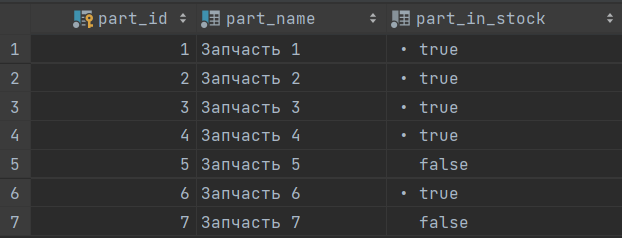


```sql
INSERT INTO parts_for_request (request_id, part_id, part_amount)
VALUES 
(1, 1, 4),
(1, 6, 8),
(2, 2, 3),
(3, 4, 2),
(4, 5, 8),
(4, 7, 10);

SELECT * FROM parts_for_request;
```
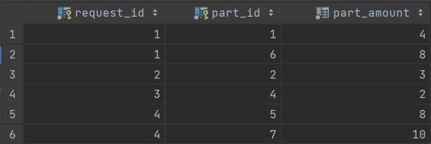


```sql
INSERT INTO consumables (cons_name, cons_in_stock)
VALUES 
('Масло 1', true),
('Масло 2', false),
('Тормозная жидкость', true),
('Антифриз 1', true),
('Смазка 1', false),
('Смазка 2', true),
('Фильтр 1', true),
('Фильтр 2', true),
('Масло 3', true);

SELECT * FROM consumables;
```

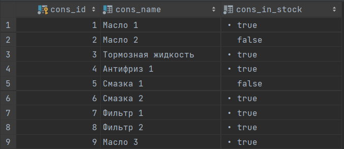


```sql
INSERT INTO cons_for_request (request_id, cons_id, cons_amount)
VALUES 
(3, 1, 1),
(3, 6, 1),
(4, 9, 2),
(4, 6, 2),
(5, 8, 2),
(5, 3, 1),
(6, 3, 1),
(6, 7, 2);

SELECT * FROM cons_for_request;
```
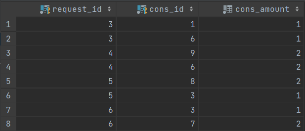


**Новая схема:**
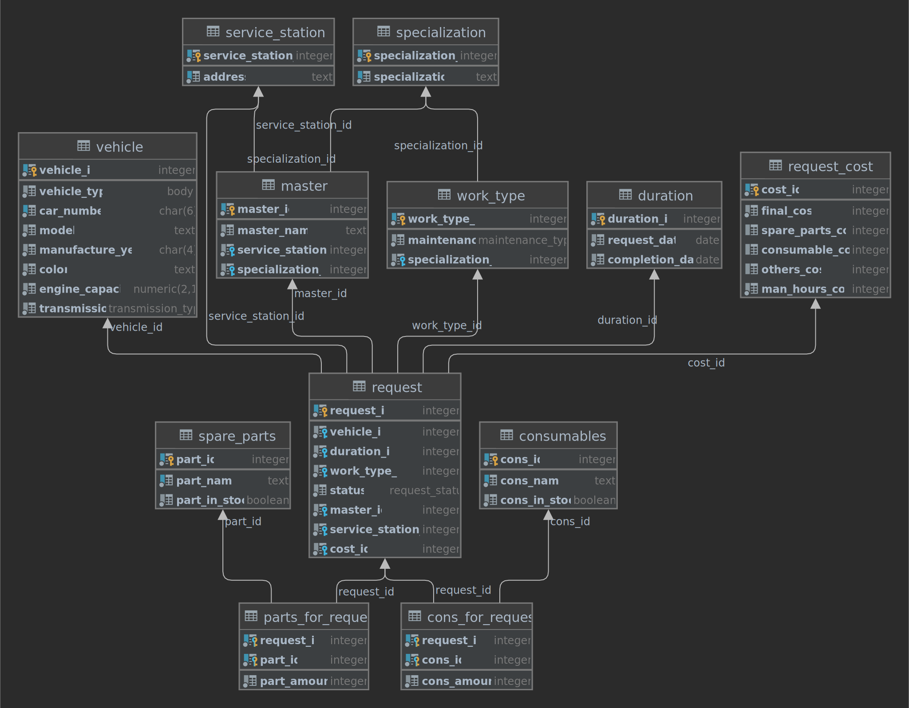


**Обновленная даталогическая диаграмма**
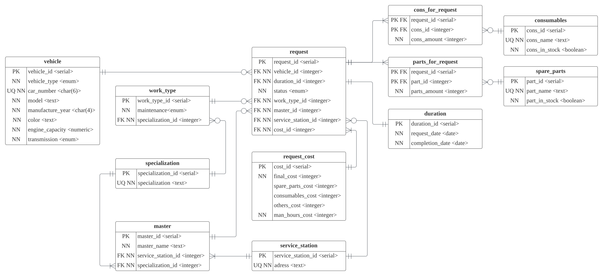


## Вывод
В ходе лабораторной работы были изучены основы работы с SQL-DDL, получены навыки создания и изменения баз данных с помощью SQL-запросов.
