# Лабораторная работа 2: Генерация тестовых данных

## Цели работы

Сформировать набор данных, позволяющий производить операции на реальных объемах данных.

## Программа работы:
1. Реализация в виде программы параметризуемого генератора, который позволит сформировать набор связанных данных в каждой таблице.
2. Частные требования к генератору, набору данных и результирующему набору данных:
- количество записей в справочных таблицах должно соответствовать ограничениям предметной области;
- количество записей в таблицах, хранящих информацию об объектах или субъектах должно быть параметром генерации;
- значения для внешних ключей необходимо брать из связанных таблиц;
- сохранение уже имеющихся данных в базе данных.

**Способы генерации данных**

- Полный рандом

Все типы полей генерируются полностью рандомно. Например, для генерации полей типа `varchar(255)` или `varchar(50)` требуется написать функцию, которая на вход будет получать максимально допустимую длину строки (255 или 50 в данном случае), а на выходе будет выдавать строки, не больше заданного размера, но при этом разной длины, так как тип `varchar` определяет строки переменной длины.

- Адаптация готовых данных

Данные могут браться из каких-либо датасетов. Однако стоит учитывать, что необходимы достаточно большого размера словари, чтобы при генерации большого количества строк в БД не возникало много дубликатов по данным.

- Смешанный

Комбинация двух предыдущих способов. Часть данных берется из готовых словарей, другая часть генерируется специально написанными функциями рандомно.


## Ход работы:
#### 1. Реализация в виде программы параметризуемого генератора, который позволит сформировать набор связанных данных в каждой таблице.

В качестве языка программирования был выбран `python`, а драйвер - `psycopg2`, а тип генерации – смешенный. 
Было написано консольное приложение, в качестве аргументов задается количество записей, генерируемых в какую-либо таблицу.
Полный код находится в файле generator.py

Для начала необходимо подключиться к `PostgreSQL` из `Python` с помощью модуля `Psycopg2`. С помощью классов и методов модуля можно взаимодействовать с базой.
Импортируем модуль `psycopg2` и некоторые другие необходимые модули. С помощью класса `Error` можно обрабатывать любые ошибки и исключения базы данных.

```python
import psycopg2
from psycopg2 import Error
import argparse
import configparser
import datetime
import calendar
import random
import pandas as pd
```

#### Подключение

```python
config = configparser.ConfigParser()
config.read('config.ini', encoding='utf-8')

try:
    # Подключение к существующей базе данных
    connection = psycopg2.connect(
        dbname=config.get("postgres", "dbname"),
        user=config.get("postgres", "user"),
        password=config.get("postgres", "password"))

    # Курсор для выполнения операций с базой данных
    cursor = connection.cursor()

    # some code

except (Exception, Error) as error:
    print("Ошибка при работе с PostgreSQL", error)
finally:
    if connection:
        connection.commit()
        cursor.close()
        connection.close()
        print("Соединение с PostgreSQL закрыто")

```

С помощью метода `connect()` создается подключение к экземпляру базы данных PostgreSQL. Он возвращает объект подключения. 
Аргументы у функции `connect()` можно было написать напрямую, но мне было интересно поработать с `ConfigParser()`.

С базой данных можно взаимодействовать с помощью класса `cursor`. Его можно получить из метода `cursor()`, который есть у объекта соединения. Он поможет выполнять SQL-команды из Python.

Код помещен в блок `try-except-finally` для перехвата исключений и ошибок базы данных.

Стоит отметить ещё то, что правильно всегда закрывать объекты `cursor` и `connection` после завершения работы, чтобы избежать проблем с базой данных. Для этого есть методы `cursor.close()` и `connection.close()`.


##### Таблица транспортных средств

За генерацию данной таблицы отвечает функция `generate_vehicle()`. 
[Таблица автомобилей](https://gitlab.icc.spbstu.ru/frid.za/database/-/blob/lab2_branch/lab2/src/cars.csv) была сформирована из датасета, взятого [здесь](https://pikabu.ru/story/bazyi_dannyikh_dlya_veb_razrabotchikov_2_4106935#comments). Я выбрала только необходимые характеристики, удалила все строки, не содержавшие какого-либо значения, и привела данные к необходимому мне формату.

Из таблицы автомобилей случайным образом выбирается строка, а из уже из неё берутся харакатеристики автомобиля. 
Цвет автомобиля так же случайным образом генерируется из [файла](https://gitlab.icc.spbstu.ru/frid.za/database/-/blob/lab2_branch/lab2/src/colors.txt). 
Номер составляется случайным образом из буквы, трех цифр и двух букв с помощью функции `rnd_number()`. Перед добавлением нормера происходит проверка, нет ли его среди уже существующих записей таблицы, а также нет ли его среди записей, которые будут добавлены при текущем запуске генератора, если номер уже существует, он будет генерироваться заново, пока не будет уникальным.

```python
colors = open("colors.txt", encoding="utf8").readlines()
cars = pd.DataFrame(pd.read_csv("cars.csv"))
digits = '0123456789'
letters_for_number = 'АВЕКМНОРСТУХ'

def generate_vehicle(n):
    global unique_nums
    cursor.execute('SELECT car_number FROM vehicle')
    unique_nums = cursor.fetchall()
    model, number, temp = [], [], []

    for i in range(int(n)):
        rand = random.randint(0, len(cars) - 1)
        model.append(cars.model[rand])
        num = rnd_number()
        while not unique(num, "num") or num in number:
            num = rnd_number()
        number.append(num)

        temp.append(tuple((cars.vehicle_type[rand], number[i], model[i].rstrip(model[i][-1]),
                               random.randint(cars.year[rand], 2022), random.choice(colors).replace('\n', ''),
                               cars.engine_capacity[rand], cars.transmission[rand],)))

    generated_vehicle = tuple(temp)
    query = "INSERT INTO vehicle (vehicle_type, car_number, model, manufacture_year, color, engine_capacity, transmission) VALUES (%s, %s, %s, %s, %s, %s, %s)"
    cursor.executemany(query, generated_vehicle)

def rnd_number():	
	string = ''
    string += random.choice(letters_for_number)
    for i in range(3):
        string += random.choice(digits)
    for i in range(2):
        string += random.choice(letters_for_number)
    return string

```
С помощью метода `execute` объекта `cursor` можно выполнить любую операцию или запрос к базе данных. В качестве параметра этот метод принимает SQL-запрос. 
Метод `executemany` позволяет выполнить один SQL-запрос для последовательности параметров. В большинстве случаев `executemany()` перебирает последовательность параметров, каждый раз передавая `execute()` методу текущие параметры.

Результаты запроса можно получить с помощью `fetchone()`, `fetchmany()`, `fetchall()`.

`cursor.fetchall()` извлекает все строки результата запроса. Он возвращает все строки в виде списка кортежей. Пустой список возвращается, если нет записей для извлечения.

`cursor.fetchmany(size)` возвращает количество строк, указанное аргументом размера. При повторном вызове этот метод извлекает следующий набор строк результата запроса и возвращает список кортежей. Если больше нет доступных строк, он возвращает пустой список.

`cursor.fetchone()` возвращает одну запись или None, если больше нет доступных строк.

Результат заполнения таблицы десятью новыми строками (ниже выделенной), при этом старые данные остаются в таблице:

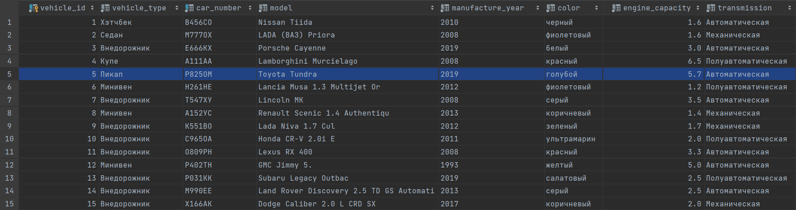


##### Таблица станций ТО

Генерация данных для этой таблицы происходит с помощью функции `generate_service_station()`.
Список улиц, проспектов и так далее берется из [файла](https://gitlab.icc.spbstu.ru/frid.za/database/-/blob/lab2_branch/lab2/src/address.txt).
Вспологательная функция `rnd_address()` берет случайное название из списка, добавляет номер дома. Адрес проверяется на уникальность аналогично проверке номера автомобиля.

```python
address = open("address.txt", encoding="utf8").readlines()

def generate_service_station(n):
    global unique_addr
    cursor.execute('SELECT address FROM service_station')
    unique_addr = cursor.fetchall()
    serst, temp = [], []

    for i in range(int(n)):
        addr = rnd_address()
        while not unique(addr, "addr") or addr in serst:
            addr = rnd_address()
        serst.append(addr)
        temp.append(tuple((serst[i],)))

    generated_address = tuple(temp)
    query = "INSERT INTO service_station (address) VALUES (%s)"
    cursor.executemany(query, generated_address)

def rnd_address():
    string = ''
    string += random.choice(address).replace('\n', '') + ", "
    r = random.choice(digits)
    while r == '0':
        r = random.choice(digits)
    string += r
    string += random.choice(digits)
    return string
```
Результат заполнения таблицы пятью новыми строками (ниже выделенной), при этом старые данные остаются в таблице:

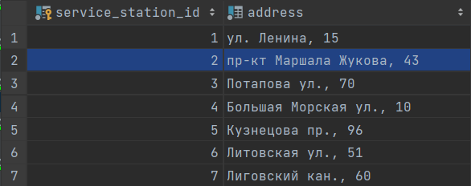

##### Таблица специализаций

За генерацию данных для этой таблицы отвечает функция `generate_specialization()`.
Вспомогательная функция `rnd_seq()` генерирует случайную последовательность из цифр и букв, условный номер специализации. Специализация проверяется на уникальность аналогично проверке номера автомобиля.
Функция `check_master()` выполняется после добавления специализаций в таблицу, так как по условию моей БД у каждой специализации должен быть хотя бы один мастер, поэтому мы "нанимаем" мастеров с этой специализацией.

```python
 def generate_specialization(n):
     global unique_spec
    cursor.execute('SELECT specialization FROM specialization')
    unique_spec = cursor.fetchall()
    spec, temp = [], []

    for i in range(int(n)):
        one_spec = "Специальзация " + rnd_seq()
        while not unique(one_spec, "spec") or one_spec in spec:
            one_spec = "Специальзация " + rnd_seq()
        spec.append(one_spec)
        temp.append(tuple((spec[i],)))

    generated_spec = tuple(temp)
    query = "INSERT INTO specialization (specialization) VALUES (%s)"
    cursor.executemany(query, generated_spec)
    check_master()

def check_master():
    global master, service_station
    cursor.execute('SELECT specialization_id FROM specialization')
    specialization = cursor.fetchall()
    cursor.execute('SELECT master_id, service_station_id, specialization_id FROM master')
    master = cursor.fetchall()
    cursor.execute('SELECT service_station_id FROM service_station')
    service_station = cursor.fetchall()

    flag = False
    temp = []

    for spec in specialization:
        if len(master) > 0:
            for row in master:
                if row[2] == spec[0]:
                    flag = True
            if not flag:
                temp.append(
                    tuple((random.choice(names).replace('\n', ''), random.choice(service_station)[0], spec[0],)))
        else:
            temp.append(
                tuple((random.choice(names).replace('\n', ''), random.choice(service_station)[0], spec[0],)))
        flag = False

    add_master = tuple(temp)
    query = "INSERT INTO master (master_name, service_station_id, specialization_id) VALUES (%s, %s, %s)"
    cursor.executemany(query, add_master)

def rnd_seq():
    string = ''
    for j in range(random.randint(2, 6)):
        string += random.choice(digits)
    for j in range(random.randint(2, 6)):
        string += random.choice(letters)
    return string
```

Результат заполнения таблицы пятнадцатью новыми строками (ниже выделенной), при этом старые данные остаются в таблице:

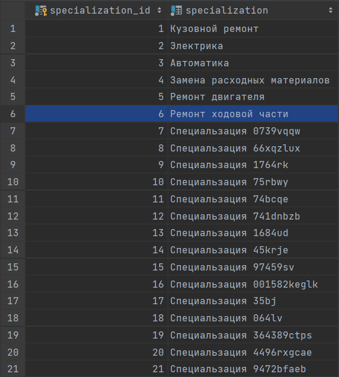

Видно, что добавилось ещё шестнадцать мастеров:

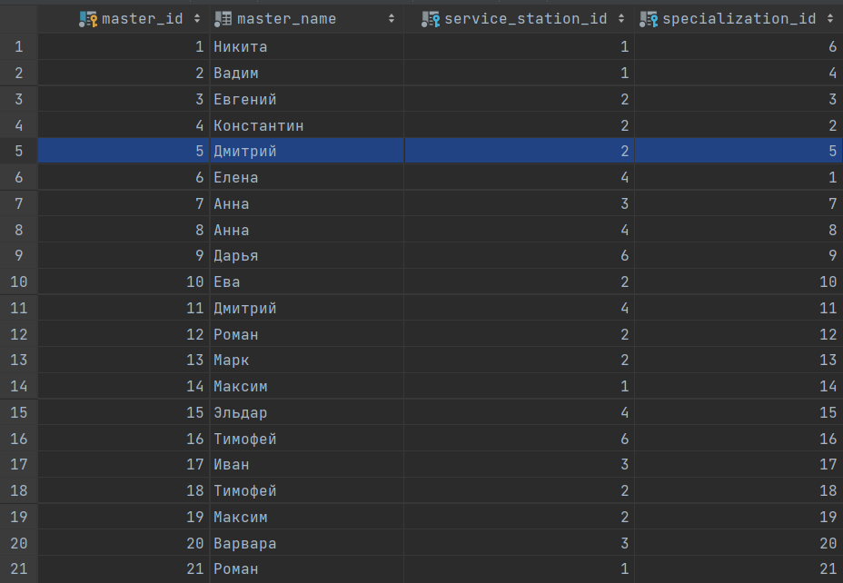

##### Таблица мастеров

За заполнение таблицы мастеров отвечает функция `generate_master`. Имена берутся из [файла](https://gitlab.icc.spbstu.ru/frid.za/database/-/blob/lab2_branch/lab2/src/names.txt).
id станции ТО и специализации берутся из уже существующих в БД.

```python
names = open("names.txt", encoding="utf8").readlines()

def generate_master(n):
    global master, service_station
    cursor.execute('SELECT service_station_id FROM service_station')
    service_station = cursor.fetchall()
    cursor.execute('SELECT specialization_id FROM specialization')
    specialization = cursor.fetchall()

    temp = []

    for i in range(int(n)):
        temp.append(tuple((random.choice(names).replace('\n', ''), random.choice(service_station)[0],
                               random.choice(specialization)[0],)))

    generated_master = tuple(temp)
    query = "INSERT INTO master (master_name, service_station_id, specialization_id) VALUES (%s, %s, %s)"
    cursor.executemany(query, generated_master)

```
В начале этой функции исполняется запрос `SELECT`, чтобы получить актуальную информацию из таблицы. 
Результат запроса с помощью `fetchall()` записывается в переменную для дальнейшей генерации данных.

Результат заполнения таблицы семью новыми строками (ниже выделенной), при этом старые данные остаются в таблице:

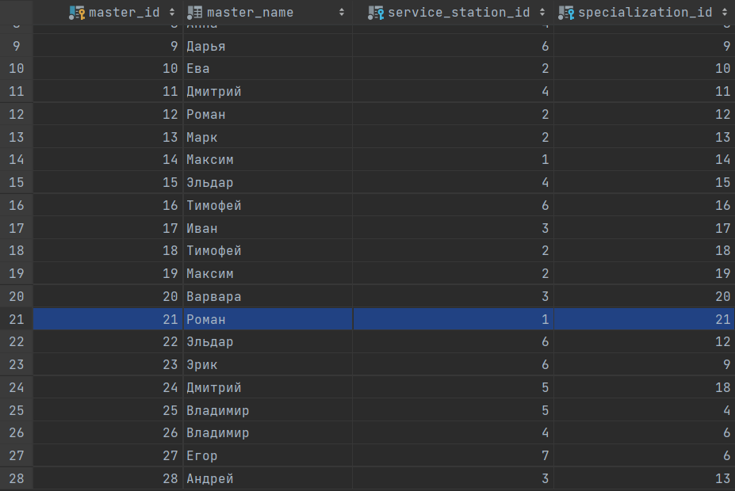

##### Таблица типов работ

Данные для этой таблицы генерируются с помощью функции `generate_work_type()`. `id` специализации берётся случайным образом из уже существующих.

```python
def generate_work_type(n):
    cursor.execute('SELECT specialization_id FROM specialization')
    specialization = cursor.fetchall()

    maintenance = ['Плановое', 'Аварийное']
    temp = []

    for i in range(int(n)):
        temp.append(tuple((random.choice(maintenance), random.choice(specialization)[0],)))

    generated_work_types = tuple(temp)
    query = "INSERT INTO work_type (maintenance, specialization_id) VALUES (%s, %s)"
    cursor.executemany(query, generated_work_types)
```

Результат заполнения таблицы десятью новыми строками (ниже выделенной), при этом старые данные остаются в таблице:

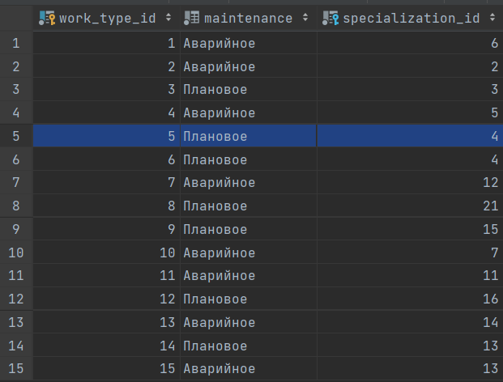


##### Таблица стоимостей

За генерацию данных для этой таблицы отвечает функция `generate_request_cost()`.
Вспомогательная функция `gen_cost()` генерирует стоимости отдельных позиций и считает общую сумму.


```python
def generate_request_cost(n):
    final, sp_cost, cons_cost, others, mh_cost = [], [], [], [], []
    temp = []

    for i in range(int(n)):
        f, sp, con, other, mh = gen_cost()
        final.append(str(f))
        sp_cost.append(str(sp))
        cons_cost.append(str(con))
        others.append(str(other))
        mh_cost.append(str(mh))
        temp.append(tuple((final[i], sp_cost[i], cons_cost[i], others[i], mh_cost[i],)))

    generated_cost = tuple(temp)
    query = "INSERT INTO request_cost (final_cost, spare_parts_cost, consumable_cost, others_cost, man_hours_cost) VALUES (%s, %s, %s, %s, %s)"
    cursor.executemany(query, generated_cost)

def gen_cost():
    y = random.randint(0, 1)
    sp = random.randint(1, 70) * 1000 * y
    yy = random.randint(0, 1)
    con = random.randint(1, 100) * 100 * yy
    other = random.randint(0, 30) * 100
    mh = random.randint(5, 200) * 100
    f = sp + con + other + mh
    return f, sp, con, other, mh
```

Результат заполнения таблицы десятью новыми строками (ниже выделенной), при этом старые данные остаются в таблице:

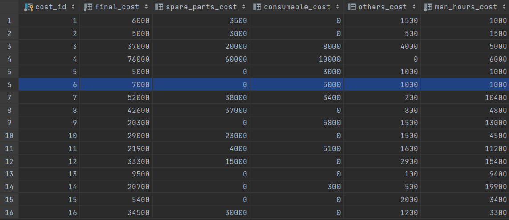

##### Таблица запчастей

Значения генерируются функцией `generate_spare_parts()`. 
Берется одно из двух слов, добавляется случайная последовательность. Наименование запчасти проверяется на уникальность аналогично проверке номера автомобиля. Случайно генерируется наличие или отсутствие.

```python
def generate_spare_parts(n):
    global unique_part
    cursor.execute('SELECT part_name FROM spare_parts')
    unique_part = cursor.fetchall()

    parts, temp = [], []

    for i in range(int(n)):
        part = random.choice(('Запчасть ', 'Деталь ')) + rnd_seq()
        while not unique(part, "part") or part in parts:
            part = random.choice(('Запчасть ', 'Деталь ')) + rnd_seq()
        parts.append(part)
        temp.append(tuple((parts[i], random.choice(('true', 'false')))))

    generated_spare_parts = tuple(temp)
    query = "INSERT INTO spare_parts (part_name, part_in_stock) VALUES (%s, %s)"
    cursor.executemany(query, generated_spare_parts)
```
Результат заполнения таблицы двадцатью пятью новыми строками (ниже выделенной), при этом старые данные остаются в таблице:

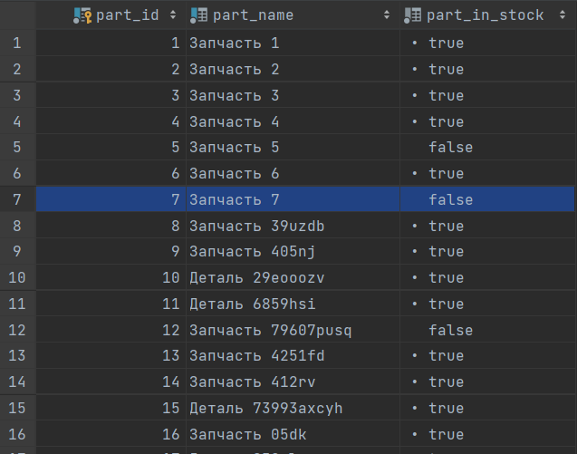
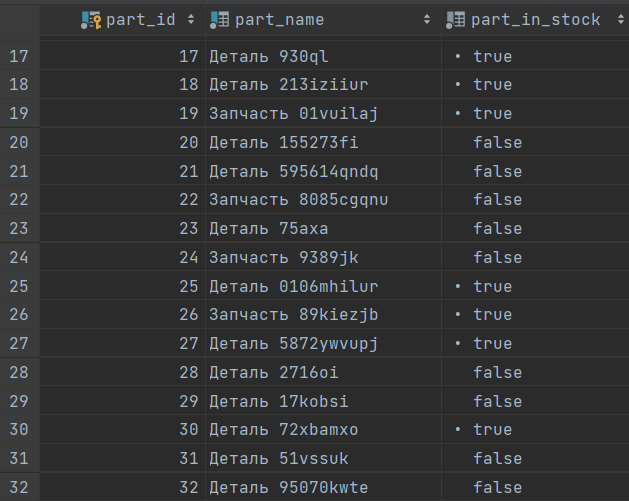


##### Таблица расходных метериалов

Значения генерируются функцией `generate_consumables()`. 
Берется одно из названий из [файла](https://gitlab.icc.spbstu.ru/frid.za/database/-/blob/lab2_branch/lab2/src/consumables.txt), добавляется случайная последовательность. Наименование расходного проверяется на уникальность аналогично проверке номера автомобиля.Случайно генерируется наличие или отсутствие.


```python
cons_list = open("consumables.txt", encoding="utf8").readlines()

def generate_consumables(n):
    global unique_cons
    cursor.execute('SELECT cons_name FROM consumables')
    unique_cons = cursor.fetchall()

    consum, temp = [], []

    for i in range(int(n)):
        cons = random.choice(cons_list).replace('\n', ' ') + rnd_seq()
        while not unique(cons, "part") or cons in consum:
            cons = random.choice(cons_list).replace('\n', ' ') + rnd_seq()
        consum.append(cons)
        temp.append(tuple((consum[i], random.choice(('true', 'false')))))

    generated_consumables = tuple(temp)
    query = "INSERT INTO consumables (cons_name, cons_in_stock) VALUES (%s, %s)"
    cursor.executemany(query, generated_consumables)
```

Результат заполнения таблицы двадцатью пятью новыми строками (ниже выделенной), при этом старые данные остаются в таблице:

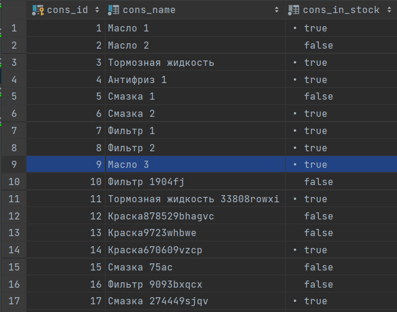
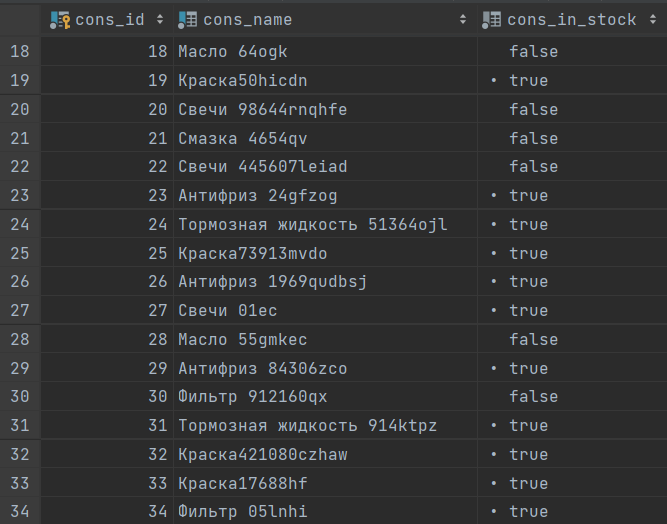


##### Таблица сроков работ

Поскольку срок работ и обращение имеют связь один к одному, при запросе на генерацию `n` новых записей в таблицу обращений необходимо сгерерировать `n` новых записей с таблицу сроков работ.
За генерацию записей в эту таблицу отвечает функция `generate_duration()`.
Вспомогательная функция `gen_dates(dur)` генерирует две даты с разницей dur (случайное число от 3 до 15).
 
```python
def generate_duration(n):
    date_from, date_to = [], []
    temp = []

    for i in range(int(n)):
        d_f, d_t = gen_dates(random.randint(3, 15))
        date_from.append(d_f)
        date_to.append(d_t)
        temp.append(tuple((date_from[i], date_to[i],)))

    generated_duration = tuple(temp)
    query = "INSERT INTO duration (request_date, completion_date) VALUES (%s, %s)"
    cursor.executemany(query, generated_duration)


def gen_dates(dur):
    month1 = random.randint(3, 4)
    d_in_m = calendar.monthrange(2022, month1)[1]
    day1 = random.randint(1, d_in_m)
    day2 = day1 + dur
    month2 = month1
    if day2 > d_in_m:
        month2 += 1
        day2 -= d_in_m
    date1 = datetime.date(2022, month1, day1).isoformat()
    date2 = datetime.date(2022, month2, day2).isoformat()

    return date1, date2
```
Результат заполнения таблицы пятнадцатью новыми строками (ниже выделенной), при этом старые данные остаются в таблице:

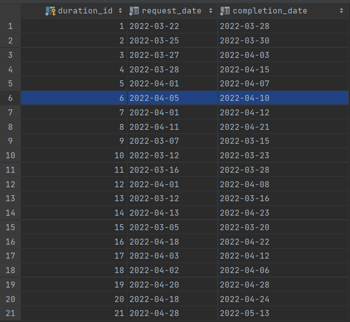

##### Таблица обращений

Генерация данных для этой функции  присходит с помощью функции `generate_request()`.
Вспомогательная функция `get_master_ss()` по `id` специализации выбранного `work_type` выбирает мастеров с данной специализацией, затем из них случайно выбирается мастера для обращения.
Вспомогательная функция `get_status()` по `duration_id` генерирует статус обращения.

```python
def generate_request(n):
    global request, master, service_station, request_cost
    cursor.execute('SELECT vehicle_id FROM vehicle')
    vehicle = cursor.fetchall()
    cursor.execute('SELECT * FROM duration')
    duration = cursor.fetchall()
    cursor.execute('SELECT work_type_id, specialization_id FROM work_type')
    work_type = cursor.fetchall()
    cursor.execute('SELECT master_id, service_station_id, specialization_id FROM master')
    master = cursor.fetchall()
    cursor.execute('SELECT service_station_id FROM service_station')
    service_station = cursor.fetchall()
    cursor.execute('SELECT cost_id, spare_parts_cost, consumable_cost FROM request_cost')
    request_cost = cursor.fetchall()
    cursor.execute('SELECT * FROM request')
    request = cursor.fetchall()

    ind = len(request)
    dur, work_t, stut, mast, serst, cost = [], [], [], [], [], []
    temp = []

    for i in range(int(n)):
        d = duration[ind]
        dur.append(d[0])
        wt = random.choice(work_type)
        work_t.append(wt[0])
        m, ss = get_master_ss(wt[1])
        mast.append(m)
        serst.append(ss)
        stut.append(get_status(d))
        temp.append(tuple((random.choice(vehicle)[0], dur[i], work_t[i], stut[i], mast[i], serst[i],
                               random.choice(request_cost)[0],)))
        ind += 1

    generated_request = tuple(temp)
    query = "INSERT INTO request (vehicle_id, duration_id, work_type_id, status, master_id, service_station_id, cost_id) VALUES (%s, %s, %s, %s, %s, %s, %s)"
    cursor.executemany(query, generated_request)

def get_master_ss(ident):
    available = []
    for row in master:
        if row[2] == ident:
            available.append(row)
    rnd = random.choice(available)
    return rnd[0], rnd[1]


def get_status(dur):
    today = datetime.date.today()
    f, t = str(dur[1]), str(dur[2])
    dat_f = datetime.date(int(f[0:4]), int(f[5:7]), int(f[8:]))
    dat_t = datetime.date(int(t[0:4]), int(t[5:7]), int(t[8:]))

    if today >= dat_t:
        return random.choice(('Завершено', 'Готово'))
    else:
        if today > dat_f:
            return random.choice(('Поступило', 'В работе', 'В работе', 'Ожидает'))
        else:
            return 'Поступило'

```
Результат заполнения таблицы пятнадцатью новыми строками (ниже выделенной), при этом старые данные остаются в таблице:

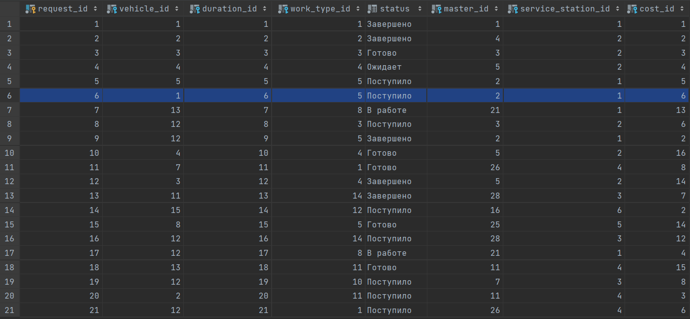


##### Таблица запчастей для обращения
Таблица заполняется автоматически при добавлении обращений. 
Вспомогательная функция `get_req()` по `cost_id` обращения выбирает те обращения, у которых `spare_parts_cost` не равен нулю.
Потом для каждого обращения из этого списка генерируется 1-2 запчасти из таблицы и необходимое количество. 
Уникальность сочетания `request_id` и `part_id` проверяется также как и уникальность номера автомобиля.

```python
def generate_parts_for_request(n):
    global request, request_cost, unique_p_f_r
    cursor.execute('SELECT request_id, cost_id FROM request')
    request = cursor.fetchall()
    cursor.execute('SELECT part_id FROM spare_parts')
    spare_parts = cursor.fetchall()
    cursor.execute('SELECT cost_id, spare_parts_cost, consumable_cost FROM request_cost')
    request_cost = cursor.fetchall()
    cursor.execute('SELECT request_id, part_id FROM parts_for_request')
    unique_p_f_r = cursor.fetchall()

    nn = int(n)
    req = get_req(1, nn, len(request))
    array_p_f_r, temp = [], []

    for r in req:
        amount = random.randint(1, 3)
        for j in range(amount):
            p_f_r = random.choice(spare_parts)[0]
            while not unique((r[0], p_f_r), "pfr") or (r[0], p_f_r) in array_p_f_r:
                p_f_r = random.choice(spare_parts)[0]
            array_p_f_r.append((r[0], p_f_r))
            temp.append(tuple((r[0],  p_f_r, str(random.randint(1, 16)),)))

    generated_parts_for_request = tuple(temp)
    query = "INSERT INTO parts_for_request (request_id, part_id, part_amount) VALUES(%s, %s, %s)"
    cursor.executemany(query, generated_parts_for_request)

def get_req(ind, n, end_ind):
    req_ = []
    for row in request[end_ind - n:]:
        i_cost = row[1]
        for c_row in request_cost:
            if c_row[0] == i_cost:
                if c_row[ind] != 0:
                    req_.append(row)
    return req_

```
Результат заполнения таблицы новыми строками (ниже выделенной), при этом старые данные остаются в таблице:

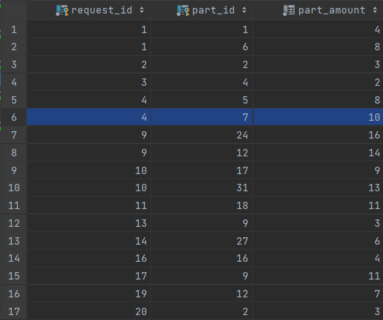

#### Таблица расходных материалов для обращений

Таблица заполняется автоматически при добавлении обращений. 
Вспомогательная функция `get_req()` по `cost_id` обращения выбирает те обращения, у которых `consumable_cost` не равен нулю.
Потом для каждого обращения из этого списка генерируется 1-2 расходных материала из таблицы и необходимое количество.
Уникальность сочетания `request_id` и `cons_id` проверяется также как и уникальность номера автомобиля.

```python
def generate_cons_for_request(n):
    global request, request_cost, unique_c_f_r
    cursor.execute('SELECT request_id, cost_id FROM request')
    request = cursor.fetchall()
    cursor.execute('SELECT cons_id FROM consumables')
    consumables = cursor.fetchall()
    cursor.execute('SELECT cost_id, spare_parts_cost, consumable_cost FROM request_cost')
    request_cost = cursor.fetchall()
    cursor.execute('SELECT request_id, cons_id FROM cons_for_request')
    unique_c_f_r = cursor.fetchall()

    nn = int(n)
    req = get_req(2, nn, len(request))
    array_c_f_r, temp = [], []

    for r in req:
        amount = random.randint(1, 3)
        for j in range(amount):
            c_f_r = random.choice(consumables)[0]
            while not unique((r[0], c_f_r), "cfr") or (r[0], c_f_r) in array_c_f_r:
                c_f_r = random.choice(consumables)[0]
            array_c_f_r.append((r[0], c_f_r))
            temp.append(tuple((r[0], c_f_r, str(random.randint(1, 16)),)))

    generated_cons_for_request = tuple(temp)
    query = "INSERT INTO cons_for_request (request_id, cons_id, cons_amount) VALUES(%s, %s, %s)"
    cursor.executemany(query, generated_cons_for_request)

```

Результат заполнения таблицы новыми строками (ниже выделенной), при этом старые данные остаются в таблице:

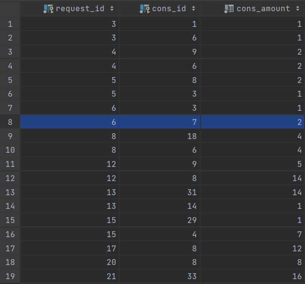

#### Удаление

С помощью передаваемых аргументов при запуске файла можно отчистить все таблицы.
При передаче `--truncate 1` вызывается следующая функция:

```python
def truncate_db():
	cursor.execute("TRUNCATE TABLE vehicle RESTART IDENTITY CASCADE;"
                    "TRUNCATE TABLE specialization RESTART IDENTITY CASCADE;"
                    "TRUNCATE TABLE request_cost RESTART IDENTITY CASCADE;"
                    "TRUNCATE TABLE service_station RESTART IDENTITY CASCADE;"
                    "TRUNCATE TABLE master RESTART IDENTITY CASCADE;"
                    "TRUNCATE TABLE work_type RESTART IDENTITY CASCADE;"
                    "TRUNCATE TABLE duration RESTART IDENTITY CASCADE;"
                    "TRUNCATE TABLE request RESTART IDENTITY CASCADE;"
                    "TRUNCATE TABLE spare_parts RESTART IDENTITY CASCADE;"
                    "TRUNCATE TABLE parts_for_request RESTART IDENTITY CASCADE;"
                    "TRUNCATE TABLE consumables RESTART IDENTITY CASCADE;"
                    "TRUNCATE TABLE cons_for_request RESTART IDENTITY CASCADE;")
```
Команда `TRUNCATE` быстро удаляет все строки из набора таблиц. Она действует так же, как безусловная команда `DELETE` для каждой таблицы, но гораздо быстрее, так как она фактически не сканирует таблицы.
`RESTART IDENTITY` - автоматически перезапускаются последовательности, связанные со столбцами опустошаемой таблицы.
`CASCADE`- автоматически опустошаются все таблицы, ссылающиеся по внешнему ключу на заданные таблицы, или на таблицы, затронутые в результате действия `CASCADE`.

#### Запуск

Чтобы запустить генерацию данных для одной или нескольких таблиц необходимо передать аргумент и желаемое число записей:

```python
pyhton generator.py [-h] [--vec VEC] [--sst SST] [--spec SPEC] [--master MASTER] [--wt WT] [--cost COST] [--part PART] [--cons CONS] [--req REQ] [--truncate TRUNCATE]
```

`--vec N`: в таблицу транспотрных средств добавится N записей.

`--spec N`: в таблицу специализаций добавится N записей.

`--sst N`: в таблицу станций тех. обслуживания добавится N записей.

`--master N`: в таблицумастеров добавится N записей.

`--wt N`: в таблицу типов работ добавится N записей.

`--cost N`: в таблицу стоимостей добавится N записей.

`--part N`: в таблицу запчастей добавится N записей.

`--cons N`: в таблицу расходных метериалов добавится N записей.

`--req N`: в таблицу обращений добавится N записей.

`--truncate 1`: все таблицы будут очищены.

*Пример:*

Передадим следующие аргументы:

```python
python generator.py --spec 5 --part 10 --cons 15
```
После исполнения в таблицу специализаций добавится 5 новых записей, в таблицу запчастей - 10, в таблицу расходных материалов - 15.


## Вывод
В ходе лабораторной работы было реализовано приложение, позволяющее производить параметризированную генерацию данных для наполнения базы данных.

## Источники
* https://pythonru.com/biblioteki/vvedenie-v-postgresql-s-python-psycopg2
* https://docs.python.org/3/library/configparser.html
* https://docs.python.org/3/library/argparse.html
* https://pynative.com/python-cursor-fetchall-fetchmany-fetchone-to-read-rows-from-table/
* https://postgrespro.ru/docs/postgrespro/9.5/sql-truncate
