# Лабораторная работа 3: Язык SQL DML

## Цели работы

Познакомить студентов с языком создания запросов управления данными SQL-DML.

## Программа работы
1. Изучение SQL-DML.
2. Выполнение всех запросов из списка стандартных запросов. Демонстрация результатов преподавателю.
3. Получение у преподавателя и реализация SQL-запросов в соответствии с индивидуальным заданием. Демонстрация результатов преподавателю.
4. Сохранение в БД выполненных запросов `SELECT` в виде представлений, запросов `INSERT`, `UPDATE` или `DELETE` -- в виде ХП. Выкладывание скрипта в GitLab.

## Ход работы:

### Список стандартных запросов

1. Сделайте выборку всех данных из каждой таблицы
2. Сделайте выборку данных из одной таблицы при нескольких условиях, с использованием логических операций, `LIKE`, `BETWEEN`, `IN` (не менее 3-х разных примеров)
3. Создайте в запросе вычисляемое поле
4. Сделайте выборку всех данных с сортировкой по нескольким полям
5. Создайте запрос, вычисляющий несколько совокупных характеристик таблиц
6. Сделайте выборку данных из связанных таблиц (не менее двух примеров)
7. Создайте запрос, рассчитывающий совокупную характеристику с использованием группировки, наложите ограничение на результат группировки
8. Придумайте и реализуйте пример использования вложенного запроса
9. С помощью оператора `INSERT` добавьте в каждую таблицу по одной записи
10. С помощью оператора `UPDATE` измените значения нескольких полей у всех записей, отвечающих заданному условию
11. С помощью оператора `DELETE` удалите запись, имеющую максимальное (минимальное) значение некоторой совокупной характеристики
12. С помощью оператора `DELETE` удалите записи в главной таблице, на которые не ссылается подчиненная таблица (используя вложенный запрос)

### Немного теории

**Data Manipulation Language (DML)** – это группа операторов для манипуляции данными. С помощью этих операторов мы можем добавлять, изменять, удалять и выгружать данные из базы, т.е. манипулировать ими.

#### Оператор выбора `SELECT`

Этот оператор возвращает ни одного, одно или множество строк, удовлетворяющих указанному условию и упорядоченных по заданному критерию. 

Полный синтаксис оператора `SELECT` имеет вид:
```
SELECT [ALL | DISTINCT] <список_выбора>
FROM <имя_таблицы>, ...
[ WHERE <условие> ]
[ GROUP BY <имя_столбца>,... ]
[ HAVING <условие> ]
[ ORDER BY <имя_столбца> [ASC | DESC],... ]
```
В квадратных скобках приведены необязательные части оператора `SELECT`. Порядок предложений в операторе `SELECT` должен строго соблюдаться:

* `SELECT <список_выбора>` -- поля таблицы значения из которых нужно выбрать (`*` - дает все поля таблицы)
* `FROM <имя_таблицы>` -- имя таблицы, из которой выбираются данные
* `WHERE <условие>` -- условие отбора (выбираются только записи, которые ему соответствуют)
* `GROUP BY <имя_столбца>[, <имя_столбца> ...]` -- определяет условие группировки
* `HAVING <условие>` -- накладывает ограничения на результаты группировки
* `ORDER BY <имя_столбца>` -- определяет по каким полям будут упорядочиваться возвращаемые записи
* `ASC | DESC` -- указывают, как сортировать по возрастанию или по убыванию

Оператор `SELECT` позволяет возвращать не только множество значений полей, но и некоторые совокупные (агрегированные) характеристики, подсчитанные по всем или по указанным записям таблицы. В SQL определены следующие агрегатные функции:
* `AVG (<имя поля>)` -- среднее по всем значениям данного поля
* `SUM (<имя поля>)` -- сумма всех значений данного поля
* `MAX (<имя поля>)` -- максимальное из всех значений данного поля
* `MIN (<имя поля>)` -- минимальное из всех значений данного поля
* `COUNT (<имя поля>)` или `COUNT (*)` -- число записей

#### Оператор `INSERT`

Добавление записей осуществляется с помощью оператора `INSERT`:
```
INSERT INTO <имя_таблицы> [ (<имя_поля>, ...) ] VALUES (<значение>, ...)
```
Производится добавление одной записи в указанную таблицу `<имя_таблицы>` и заносятся значения для выбранных полей. 
Если имена полей не указаны, то значения заносятся во все поля таблицы. Набор полей должен быть согласован с набором заносимых значений. 
Для остальных полей заносятся значения определенные по умолчанию, а если таковых не имеется то в них записывается `NULL`.

#### Оператор `DELETE`

Удаление одной или нескольких записей осуществляется с помощью оператора `DELETE`:
```
DELETE FROM <имя_таблицы> [ WHERE <условие> ]
```
Удаляются все записи, удовлетворяющие указанному условию. Если ключевое слово `WHERE` и условие отсутствуют, из таблицы удаляются все записи.

#### Оператор `UPDATE`

Модификация записей осуществляется оператором `UPDATE`:
```
UPDATE <имя_таблицы>
SET <имя_столбца> = <значение>, ...
[WHERE <условие>]
```
Для заданной таблицы изменяются значения указанных в операторе столбцов. 
Если задано ключевое слово `WHERE` и условие, то оператор `UPDATE` применяется только к тем записям, для которых оно выполняется. 
Если условие не задано, `UPDATE` применяется ко всем записям.


### Написание стандартных запрсов

*1. Сделайте выборку всех данных из каждой таблицы*

```sql
CREATE OR REPLACE VIEW vehicle_v1 AS SELECT * FROM vehicle;
SELECT * FROM vehicle_v1;

CREATE OR REPLACE VIEW service_station_v1 AS SELECT * FROM service_station;
SELECT * FROM service_station_v1;

CREATE OR REPLACE VIEW master_v1 AS SELECT * FROM master;
SELECT * FROM master_v1;

CREATE OR REPLACE VIEW specialization_v1 AS SELECT * FROM specialization;
SELECT * FROM specialization_v1;

CREATE OR REPLACE VIEW work_type_v1 AS SELECT * FROM work_type;
SELECT * FROM work_type_v1;

CREATE OR REPLACE VIEW request_cost_v1 AS SELECT * FROM request_cost;
SELECT * FROM request_cost_v1;

CREATE OR REPLACE VIEW spare_parts_v1 AS SELECT * FROM spare_parts;
SELECT * FROM spare_parts_v1;

CREATE OR REPLACE VIEW consumables_v1 AS SELECT * FROM consumables;
SELECT * FROM consumables_v1;

CREATE OR REPLACE VIEW duration_v1 AS SELECT * FROM duration;
SELECT * FROM duration_v1;

CREATE OR REPLACE VIEW request_v1 AS SELECT * FROM request;
SELECT * FROM request_v1;

CREATE OR REPLACE VIEW parts_for_request_v1 AS SELECT * FROM parts_for_request;
SELECT * FROM parts_for_request_v1;

CREATE OR REPLACE VIEW cons_for_request_v1 AS SELECT * FROM cons_for_request;
SELECT * FROM cons_for_request_v1;
```


*2. Сделайте выборку данных из одной таблицы при нескольких условиях, с использованием логических операций, `LIKE`, `BETWEEN`, `IN` (не менее 3-х разных примеров)*

Оператор `LIKE` принимает шаблон строки, которому должно соответствовать выражение.
Для определения шаблона могут применяться ряд специальных символов подстановки:
* %: соответствует любой подстроке, которая может иметь любое количество символов, при этом подстрока может и не содержать ни одного символа
* _: соответствует любому одиночному символу

Выберем из таблицы транспортных средств все строки, где название модели начинается с 'Nissan'.

```sql
CREATE OR REPLACE VIEW vehicle_like AS SELECT * FROM vehicle
WHERE model LIKE 'Nissan%'; 

SELECT * FROM vehicle_like;
```
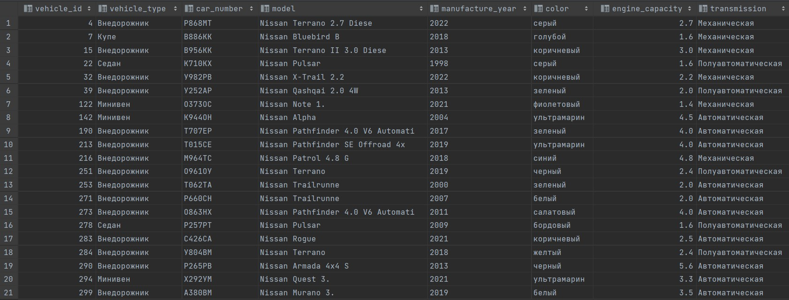


Оператор `BETWEEN` определяет диапазон значений с помощью начального и конечного значения, которому должно соответствовать выражение.

Выберем все строки, где объем двигателя от 5.0 до 5.5.

```sql
CREATE OR REPLACE VIEW vehicle_between AS SELECT * FROM vehicle
WHERE engine_capacity BETWEEN 5.0 AND 5.5;

SELECT * FROM vehicle_between;
```
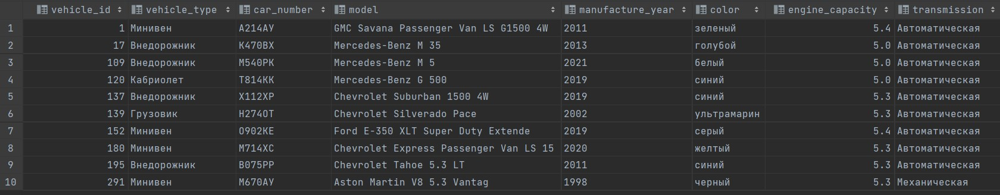


Оператор `IN` позволяет определить набор значений, которые должны иметь столбцы. Выражение в скобках после `IN` определяет набор значений.

Выберем все строки, где тип кузова 'Купе' или 'Фургон'.

```sql
CREATE OR REPLACE VIEW vehicle_in AS SELECT * FROM vehicle
WHERE vehicle_type IN ('Купе', 'Фургон');

SELECT * FROM vehicle_in;
```
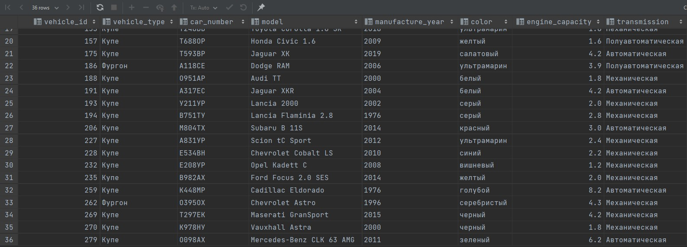


*3. Создайте в запросе вычисляемое поле*

В таблице сроков работ посчитаем количество дней между датой обращения и датой завершения работ.

```sql
CREATE OR REPLACE VIEW duration_days AS
SELECT *, (completion_date - request_date) AS days FROM duration;

SELECT * FROM duration_days;
```
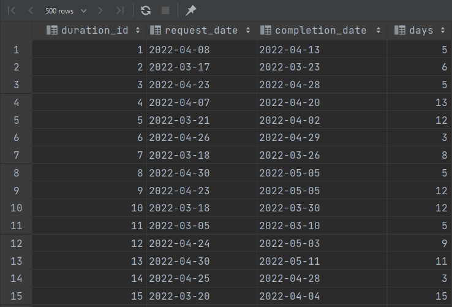


*4. Сделайте выборку всех данных с сортировкой по нескольким полям*

Оператор `ORDER BY` позволяет отсортировать значения по определенному столбцу.

Отсортируем таблицу обращений по `id` транспортного средства и статусу обращения.

```sql
CREATE OR REPLACE VIEW request_order AS
SELECT * FROM request ORDER BY vehicle_id, status;

SELECT * FROM request_order;
```
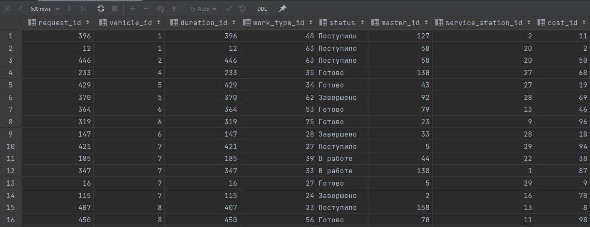


*5. Создайте запрос, вычисляющий несколько совокупных характеристик таблиц*

Агрегатные функции вычисляют одно значение над некоторым набором строк. В PostgreSQL имеются следующие агрегатные функции:

* `AVG`: находит среднее значение. Входной параметр должен представлять один из следующих типов: `smallint`, `int`, `bigint`, `real`, `double` `precision`, `numeric`, `interval`. Для целочисленнных параметров результатом будет значение типа `numeric`, для параметров, которые представляют число с плавающей точкой, - значение типа `double precision`.
* `MIN`: находит наименьшее значение
* `MAX`: находит наибольшее значение

Посчитаем среднее, максимальное и минимальное количество запчастей одного вида необходимых для ремонта.

```sql
CREATE OR REPLACE VIEW avg AS
SELECT AVG(part_amount), MAX(part_amount), MIN(part_amount) FROM parts_for_request;

SELECT * FROM avg;
```
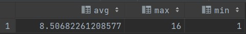


*6. Сделайте выборку данных из связанных таблиц (не менее двух примеров)*

Одним из способов соединения таблиц является использование оператора `JOIN` или `INNER JOIN`. Он представляет так называемое внутренее соединение.
После оператора `JOIN` идет название второй таблицы, данные которой надо добавить в выборку. 
Далее после ключевого слова `ON` указывается условие соединения. Это условие устанавливает, как две таблицы будут сравниваться. Как правило, для соединения применяется первичный ключ главной таблицы и внешний ключ зависимой таблицы.

Из таблиц мастеров и станций ТО выберем `id` мастера, `id` станции ТО, на которой он работает, адрес этой ТО.

```sql
CREATE OR REPLACE VIEW join_m_sst AS
SELECT m.master_id, m.service_station_id, ss.address
FROM master m INNER JOIN service_station ss on m.service_station_id = ss.service_station_id;

SELECT * FROM join_m_sst;
```

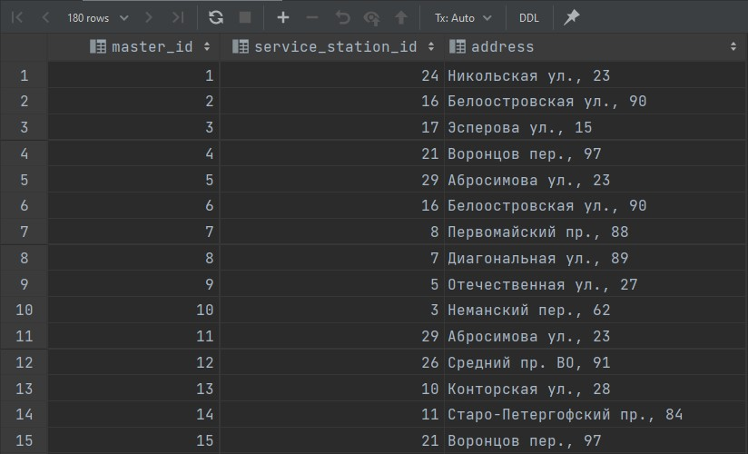

Из таблиц мастеров и типов работ выберем `id` типа работ, `id` его специализации, `id` мастера с этой специализацией и вид тех. обслуживания.

```sql
CREATE OR REPLACE VIEW join_m_wt AS
SELECT wt.work_type_id, wt.specialization_id, m.master_id,  wt.maintenance
FROM work_type wt INNER JOIN master m on m.specialization_id = wt.specialization_id;

SELECT * FROM join_m_wt;
```

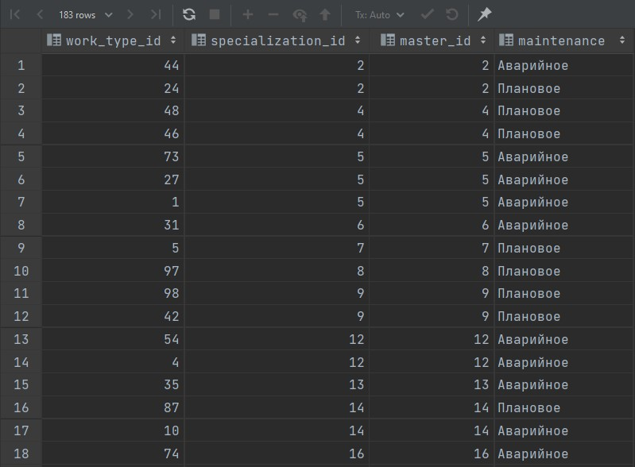


*7. Создайте запрос, рассчитывающий совокупную характеристику с использованием группировки, наложите ограничение на результат группировки*

Для группировки данных в PostgreSQL применяются операторы `GROUP BY` и `HAVING`. `COUNT(*)`: находит количество строк в запросе.
`COUNT(expression)`: находит количество строк в запросе, для которых `expression` не содержит значение `NULL`.

Посчитали количество типов работ с конкретной специализацией, при этом `id` специализации > 20:

```sql
CREATE OR REPLACE VIEW count AS
SELECT specialization_id, COUNT(work_type_id) FROM work_type GROUP BY specialization_id HAVING specialization_id > 20;

SELECT * FROM count;
```
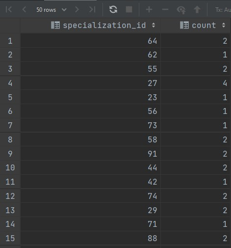


*8. Придумайте и реализуйте пример использования вложенного запроса*

Подзапросы (subquery) представляют такие запросы, которые могут быть встроены в другие запросы.

Выберем из таблицы обращений те строки, у которых финальная стоимость 20500. 

```sql
CREATE OR REPLACE VIEW nested AS
SELECT * FROM request r WHERE r.cost_id = (SELECT c.cost_id FROM request_cost c WHERE c.final_cost IN (20500));

SELECT * FROM nested;
```

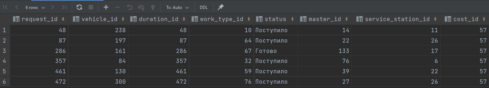


*9. С помощью оператора `INSERT` добавьте в каждую таблицу по одной записи*

Такие запросы были сделаны в работе 1.2, результаты можно посмотреть [там](https://gitlab.icc.spbstu.ru/frid.za/database/-/tree/lab1.2_branch/lab1/lab1.2).

```sql
INSERT INTO vehicle (vehicle_type, car_number, model, manufacture_year, color, engine_capacity, transmission)
VALUES ('Хэтчбек', 'B456CO', 'Nissan Tiida', '2010', 'черный', 1.6, 'Автоматическая');

INSERT INTO specialization (specialization)
VALUES ('Кузовной ремонт');

INSERT INTO duration (request_date, completion_date)
VALUES ('2022-03-22', '2022-03-28');

INSERT INTO request_cost (final_cost, spare_parts_cost, consumable_cost, others_cost, man_hours_cost)
VALUES (6000, 3500, 0, 1500, 1000);

INSERT INTO service_station (address)
VALUES ('ул. Ленина, 15');

INSERT INTO master (master_name, service_station_id, specialization_id)
VALUES ('Никита', 31, 101);

INSERT INTO work_type (maintenance, specialization_id)
VALUES ('Аварийное', 101);

INSERT INTO request (vehicle_id, duration_id, work_type_id, status, master_id, service_station_id, cost_id)
VALUES (301, 501, 101, 'Завершено', 181, 31, 101);

INSERT INTO spare_parts (part_name, part_in_stock)
VALUES ('Болт №5', true);

INSERT INTO parts_for_request (request_id, part_id, part_amount)
VALUES (501, 401, 4), (501, 8, 5);

INSERT INTO consumables (cons_name, cons_in_stock)
VALUES  ('Краска №5', true);

INSERT INTO cons_for_request (request_id, cons_id, cons_amount)
VALUES (21, 401, 1);
```


*10. С помощью оператора `UPDATE` измените значения нескольких полей у всех записей, отвечающих заданному условию*

Сделаем выборку из таблицы транспортных средств с типом кузова 'Фургон' до изменений:
```sql
SELECT * FROM vehicle WHERE vehicle_type IN ('Фургон');
```
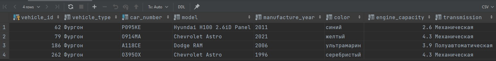

Теперь у всех этих машин обновим объём двигателя на 5.0:

```sql
UPDATE vehicle SET engine_capacity = 5.0 WHERE vehicle_type IN ('Фургон');
```
Результат:

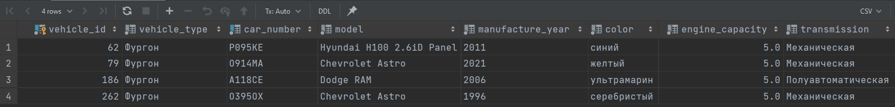


*11. С помощью оператора `DELETE` удалите запись, имеющую максимальное (минимальное) значение некоторой совокупной характеристики*

Удалим последнее добавленное транспортное средство. До выполнения запроса:

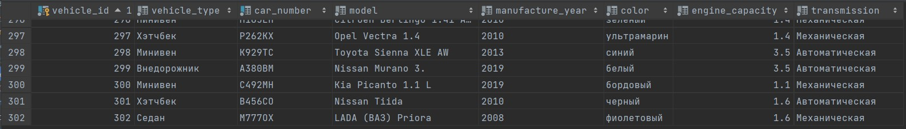

```sql
DELETE FROM vehicle WHERE vehicle_id = (SELECT MAX(vehicle_id) FROM vehicle);
```

После выполнения запроса:

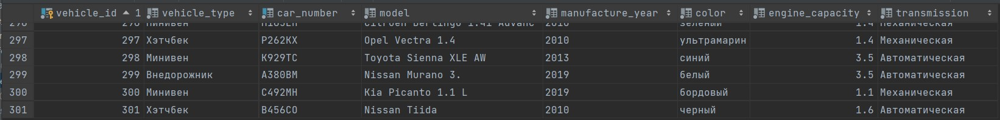


*12. С помощью оператора `DELETE` удалите записи в главной таблице, на которые не ссылается подчиненная таблица (используя вложенный запрос)*

Удалим все транспортные средства, которые не числятся ни в одном обращении. До выполнения запроса:

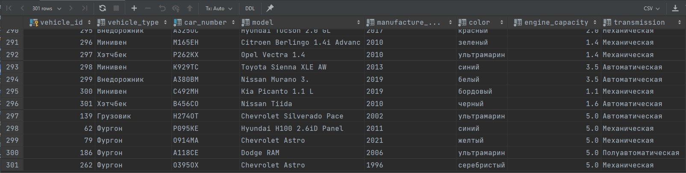

```sql
DELETE FROM vehicle WHERE vehicle_id NOT IN (SELECT vehicle_id FROM request);
```

После выполнения запроса:

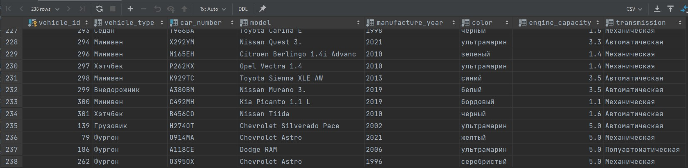


### Индивидуальное задание

*1. Сделать выборку транспортных средств с группировкой по столбцу `model`, подсчитывая суммарное количество расходников и деталей, которые потребовались для обслуживания этих ТС, и их суммарные стоимости. То есть в результате должны быть следующие столбцы: `model`, число расходников, число деталей, стоимость расходников, стоимость деталей. Упорядочить по столбцу `model` в алфавитном порядке.*

Сначала выберем необходимые столбца из таблиц и сгруппируем их по `request_id`, то есть количество всех деталей и расходников суммируется для одного обращения:

```sql
CREATE OR REPLACE VIEW view1 AS
    SELECT r.request_id, v.vehicle_id, v.model,
        SUM(COALESCE (pfr.part_amount, 0)) AS full_part_amount,
        SUM(COALESCE (cfr.cons_amount, 0)) AS full_cons_amount,
        rc.spare_parts_cost AS full_parts_cost,
        rc.consumable_cost AS full_cons_cost
FROM vehicle v
JOIN request r ON v.vehicle_id = r.vehicle_id
JOIN request_cost rc ON r.cost_id = rc.cost_id
FULL JOIN parts_for_request pfr ON r.request_id = pfr.request_id
FULL JOIN cons_for_request cfr on r.request_id = cfr.request_id
GROUP BY  r.request_id, v.vehicle_id, v.model, rc.spare_parts_cost,
      rc.consumable_cost;

SELECT * FROM view1;
```

Промежуточный результат:
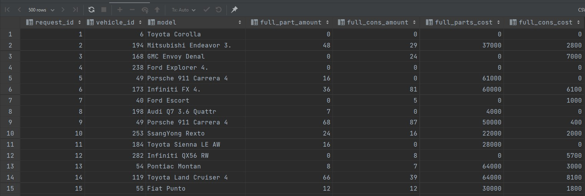

Теперь, согласно заданию, сгруппируем по столбцу `model`, подсчитывая суммарное количество расходников и деталей, которые потребовались для обслуживания этих ТС, и их суммарные стоимости:

```sql
CREATE OR REPLACE VIEW amount_for_vehicle AS
    SELECT model,
           SUM(full_part_amount) AS full_part_amount,
           SUM(full_cons_amount) AS full_cons_amount,
           SUM(full_parts_cost) AS full_parts_cost,
           SUM(full_cons_cost) AS full_cons_cost
FROM (SELECT * FROM view1) as "v1*"
GROUP BY model
ORDER BY model;

SELECT * FROM amount_for_vehicle;
```
Результат:
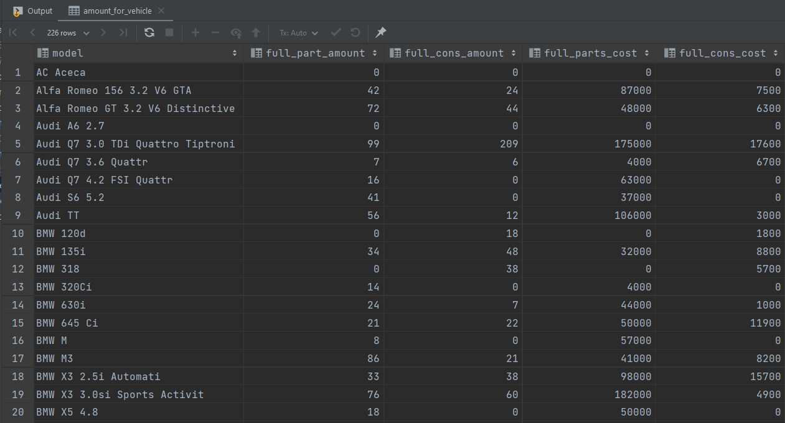


*2. Вывести топ-10 мастеров по количеству выполненных обращений за последний год. В выводе должны присутствовать столбцы с именем мастера, названием его специализации, адресом СТО, где он работает, а также количеством выполненных обращений и их суммарной стоимостью.*

```sql
CREATE OR REPLACE VIEW top_ten AS
SELECT m.master_name, s.specialization, ss.address,
       COUNT(r.master_id) AS work_num, SUM(rc.final_cost)
FROM master m
JOIN specialization s ON m.specialization_id = s.specialization_id
JOIN service_station ss ON m.service_station_id = ss.service_station_id
JOIN request r ON m.master_id = r.master_id
JOIN request_cost rc on r.cost_id = rc.cost_id
JOIN duration d on r.duration_id = d.duration_id WHERE d.request_date >= '2022-01-01' AND r.status = 'Завершено'
GROUP BY m.master_name, s.specialization, ss.address
ORDER BY work_num DESC
LIMIT 10;

SELECT * FROM top_ten;
```

Результат:

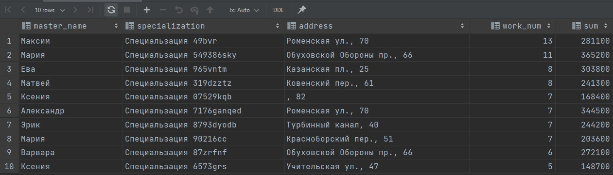


*3. Написать триггер, который автоматически проставляет текущую дату в качестве `completion_date` для обращений, статус которых в таблице `request` меняется на 'Завершено'.*

[Триггер](https://postgrespro.ru/docs/postgresql/13/triggers) является указанием, что база данных должна автоматически выполнить заданную функцию, всякий раз когда выполнен определённый тип операции, в частности, при добавлении, изменении или удалении данных, то есть при выполнении команд `INSERT`, `UPDATE`, `DELETE`. Триггеры можно использовать с таблицами (секционированными и обычными), с представлениями и с внешними таблицами.

```sql
CREATE OR REPLACE FUNCTION change_status() RETURNS TRIGGER AS $$
DECLARE
    stat request_status;
    id integer;
BEGIN
    stat = CAST(NEW.status as request_status);
    id = CAST(NEW.duration_id as integer);
    if (stat = 'Завершено') then UPDATE duration SET completion_date = current_date WHERE duration_id = id; end if;
    RETURN NEW;
END;
$$ LANGUAGE plpgsql;

CREATE TRIGGER change_status AFTER INSERT OR UPDATE OF status ON request
    FOR EACH ROW EXECUTE FUNCTION change_status();
```

Посмотрим на таблицы обращений и сроков работ до изменений:

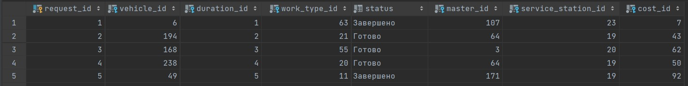
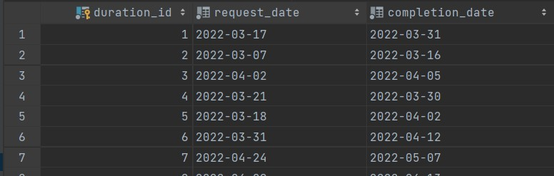


Теперь у обращений с id равным 2 и 3 изменим статус на `'Завершено'`:

```sql
UPDATE request SET status = 'Завершено' WHERE request_id = 2 OR request_id = 3;
```

Посмотрим на результат:

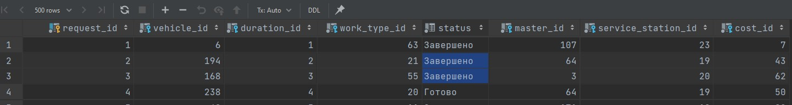
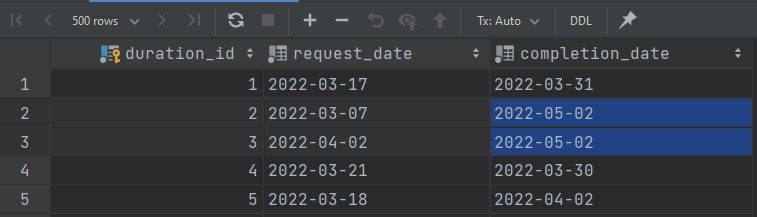

Как видим у соответствующих запросов `completion_date` изменилась на сегодняшнюю (данный пункт выполнялся 02.05.22).

Попробуем изменить статус на какой-нибудь другой, например, изменим статус у обращения с id = 9 на `'Готово'`:

```sql
UPDATE request SET status = 'Готово' WHERE request_id = 9;
```

До выполнений запроса:

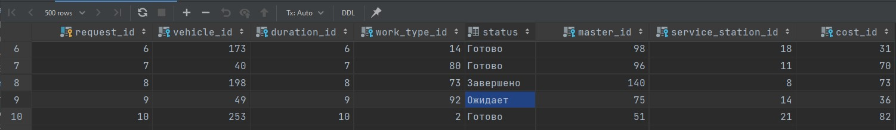
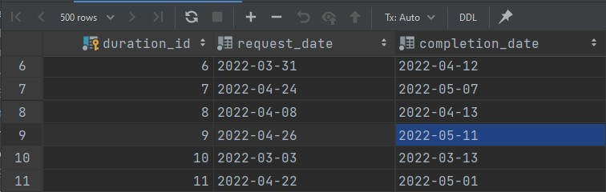

После выполнения запроса:

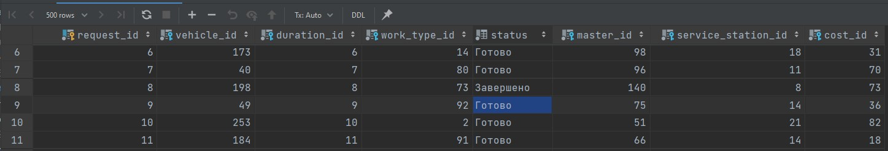
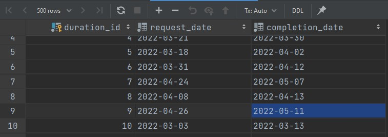

Как и ожидалось, дата не изменилась.

## Выводы
В ходе выполнения данной лабораторной работы был изучен язык создания запросов управления данными SQL-DML.
Были изучены операторы `SELECT`, `INSERT`, `UPDATE` и `DELETE`, а также написан ряд запросов с их использованием, а также с использованием операций сравненения, подзапросов, агрегатных функций, сортировок, группировок, наложений ограничений.
