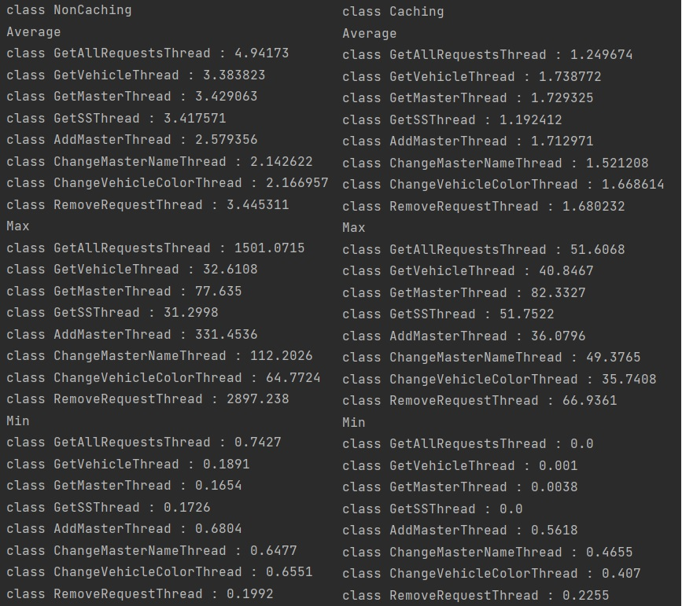

# Лабораторная работа 4: Кэширование

## Цели работы

Знакомство студентов с алгоритмами кэширования.
В рамках данной работы необходимо разработать кэширующий SQL-proxy - программу, которая принимала бы запросы к БД, отправляла эти запросы в БД, сохраняла бы результаты в хранилище. Если приходит повторный запрос на чтение - выдавала запросы из хранилища, если приходит запрос на изменение - сбрасывала бы значения всех запросов, результаты которых станут неактуальными после внесенных изменений.

## Программа работы
1. Общее описание:
    - для данной работы необходимо выбрать часть таблиц БД (3+), для которой можно придумать/использовать осмысленные SQL-запросы, необходимые для выполнения пользовательских функций
    - в рамках работы необходимо реализовать две программы: кэширующий прокси и программа для выполнения запросов и измерения результатов
2. Выбор понравившегося способа кэширования:
    - в памяти программы
    - с использованием внешних хранилищ
    - во внешней памяти
3. Реализация выбранного способа
    - преобразование входных запросов
    - выбор ключа для хранения результатов
    - реализация алгоритма поиска сохраненных результатов, которые надо сбросить после внесения изменений в БД
4. Снятие показательных характеристик
    - в программе для формирования потока запросов к БД на чтение/изменение/удаление должна быть возможность настройки соотношения запросов, количества запросов разных типов в потоке и измерения временных характеристик: среднее/минимальное/максимальное время выполнения запроса по типу, необходимо иметь возможность проанализировать эффективность кэширования в различных сценариев: преимущественно чтение, преимущественно изменение, преимущественно удаление
    - измерения можно производить путем простого сравнения отметок текущего времени до и после выполнения запросов
5. Анализ полученных результатов и сравнение реализаций с кэшем и без между собой.
6. Демонстрация результатов преподавателю.

## Ход работы

Весь код представлен на [github](https://github.com/zina-frid/database/tree/main/lab4/cashe_db).

Для данной лабораторной работы выбраны следующие таблицы и запросы к ним:
1. Таблица обращений
    - запрос на чтение всех обращений
    - запрос на удаление обращения по заданному id
2. Таблица транспортных средств
    - запрос чтение информации о транспортном средстве по заданному id
    - запрос на изменение цвета ТС по заданному id
3. Таблица мастеров
    - запрос на чтение информации о мастере по заданному id
    - запрос на добавление нового мастера в таблицу
    - запрос на изменение имени мастера по заданному id
4. Таблица станций ТО
    - запрос на чтение информации о станции ТО

### Соединение с базой данных
Так как для генерации данных я использовала язык `Python`, в этой работе решила поработать с `Kotlin` и `jdbc`.

*JDBC (Java DataBase Connectivity)* - стандарт взаимодействия Java-приложений с СУБД. Его реализация находится в пакете `java.sql`. Сама концепция JDBC - использование драйверов, при помощи которых соединение с БД происходит по URL.

`Hikari` обеспечивает нас механизмом пула соединений. 
`Kotlin Exposed` - это фреймворк, который позволяет взаимодействовать с базами данных, представляя их элементы как элементы ООП. 

Для начала надо подключиться к БД. Для этого используется метод инициализации Hikari DataSource и подключения к нашей БД. В методе `hikari` создаём конфигурацию. Необходимо указать адрес для jbdc, класс драйвера для нашей базы данных, и данные о пользователе, и главное, отключим кэширование.
```kotlin
import com.zaxxer.hikari.HikariConfig
import com.zaxxer.hikari.HikariDataSource

private fun connectToDatabase() {
    fun hikari(): HikariDataSource {
        val config = HikariConfig()
        config.driverClassName = "org.postgresql.Driver"
        config.jdbcUrl = "jdbc:postgresql://127.0.0.1:5432/services"
        config.username = "postgres"
        config.password = "****"
        config.maximumPoolSize = 9
        config.isAutoCommit = false
        config.addDataSourceProperty("cachePrepStmts", "false")
        config.transactionIsolation = "TRANSACTION_READ_COMMITTED"
        config.validate()
        return HikariDataSource(config)
    }

    Database.connect(hikari())
}
```

### Программа для выполнения запросов

Для начала напишем интерфейс `Interaction`, в котором определим все методы, отвечающие за вышеописанные запросы к БД. Это сделано потому, что у нас есть 2 варианта работы с БД: без кэширования и с кэшированием, следовательно, будет удобно наследоваться от одного интерфейса и реализовывать/переопределять методы.

```kotlin
import org.jetbrains.exposed.sql.ResultRow

interface Interaction {
    fun getAllRequests() : List<ResultRow>

    fun addMaster(name: String, ss_id: Int, spec_id: Int)

    fun getVehicle(vehicle_id: Int) : List<ResultRow>

    fun getMaster(master_id: Int) : List<ResultRow>

    fun changeMasterName(master_id: Int, new_name: String)

    fun changeVehicleColor(vehicle_id: Int, new_color: String)

    fun getSS(ss_id: Int) : List<ResultRow>

    fun removeRequest(request_id: Int)
}
```

Теперь напишем `NonCaching`, который наследуется от `Interaction`. Здесь мы уже полностью определим методы, которые выполняю описанные выше запросы.

```kotlin
import org.jetbrains.exposed.sql.*
import org.jetbrains.exposed.sql.transactions.transaction

object NonCaching : Interaction {

    override fun getAllRequests() =
        transaction { request.selectAll().toList() }

    override fun getVehicle(vehicle_id: Int) =
        transaction { vehicle.select { vehicle.vehicle_id eq vehicle_id }.toList() }

    override fun getMaster(master_id: Int) =
        transaction { master.select { master.master_id eq master_id }.toList() }

    override fun getSS(ss_id: Int) =
        transaction { service_station.select { service_station.service_station_id eq ss_id }.toList() }

    override fun addMaster(name: String, ss_id: Int, spec_id: Int) {
        transaction {
            master.insert {
                it[master_name] = name
                it[service_station_id] = ss_id
                it[specialization_id] = spec_id
            }
        }
    }

    override fun changeMasterName(master_id: Int, new_name: String) {
        transaction {
            master.update({ master.master_id eq master_id }) {
                it[master_name] = new_name
            }
        }
    }

    override fun changeVehicleColor(vehicle_id: Int, new_color: String) {
        transaction {
            vehicle.update({ vehicle.vehicle_id eq vehicle_id }) {
                it[color] = new_color
            }
        }
    }

    override fun removeRequest(request_id: Int) {
        transaction {
            request.deleteWhere { request.request_id eq request_id }
        }
    }

}
```
Тут стоит обратить внимание на `transaction {}`. Метод транзакции принимает закрытие и вызывает его с активной транзакцией ([Источник](https://www.baeldung.com/kotlin/exposed-persistence)).


Ещё стоит отметить, что при удалении запроса в последнем методе `removeRequest()` возникнет ошибка из-за того, что `request_id` связан с другой таблицей. Поэтому в таблицах `parts_for_request` и `cons_for_request` добавим поведение при удалении:

```sql
ALTER TABLE parts_for_request
DROP CONSTRAINT parts_for_request_request_id_fkey,
ADD CONSTRAINT parts_for_request_request_id_fkey
  FOREIGN KEY (request_id)
  REFERENCES request(request_id)
  ON DELETE CASCADE;

ALTER TABLE parts_for_request
DROP CONSTRAINT parts_for_request_part_id_fkey,
ADD CONSTRAINT parts_for_request_part_id_fkey
  FOREIGN KEY (part_id)
  REFERENCES spare_parts(part_id)
  ON DELETE RESTRICT;


ALTER TABLE cons_for_request
DROP CONSTRAINT cons_for_request_request_id_fkey,
ADD CONSTRAINT cons_for_request_request_id_fkey
  FOREIGN KEY (request_id)
  REFERENCES request(request_id)
  ON DELETE CASCADE;

ALTER TABLE cons_for_request
DROP CONSTRAINT cons_for_request_cons_id_fkey,
ADD CONSTRAINT cons_for_request_cons_id_fkey
  FOREIGN KEY (cons_id)
  REFERENCES consumables(cons_id)
  ON DELETE RESTRICT;
```
`CASCADE`: автоматически удаляет или изменяет строки из зависимой таблицы при удалении или изменении связанных строк в главной таблице.

`RESTRICT`: предотвращает какие-либо действия в зависимой таблице при удалении или изменении связанных строк в главной таблице. То есть фактически какие-либо действия отсутствуют.

Теперь можно спокойно удалять строки из таблицы `request` и не получать ошибок.


### Кэширование

Для начала напишем класс `CacheBasedOnLRU`, который наследуется от `MutableMap`. Кэш основын на алгоритме `LRU`, поэтому при достижении указанного лимита из нашего `ConcurrentLinkedHashMap` начнут удаляться записи.

```kotlin
import com.googlecode.concurrentlinkedhashmap.ConcurrentLinkedHashMap

class CacheBasedOnLRU<K, V>(capacity: Long) :
    MutableMap<K, V> by ConcurrentLinkedHashMap.Builder<K, V>().maximumWeightedCapacity(capacity).build()
```
[`ConcurrentLinkedHashMap`](https://github.com/ben-manes/concurrentlinkedhashmap) - высокопроизводительная версия [java.util.LinkedHashMap](https://docs.oracle.com/javase/6/docs/api/java/util/LinkedHashMap.html) для использования в качестве кэша программного обеспечения.

Стоит отметить, что при этом, чтоб внутри не писать чт-то вроде `val internalCache = ConcurrentLinked...` и потом не переопределять все методы `MutableMap`, как, например, `put -> internalCache.put()`, используется делегирование. 


В качестве ключей для кэша, будем брать объект наследованный от `Key`:

```kotlin
sealed interface Key

data class VehicleKey(private val vehicle_id: Int) : Key

data class MasterKey(private val master_id: Int) : Key

data class SSKey(private val ss_id: Int) : Key

object AllRequestsKey : Key
```
Разные классы, чтобы отличать одинаковые Int'ы между собой, чтоб в нашей мапе-кэше не возникло ситуации, что там 2 одинаковых Int, но подразумевалось, что это id разных сущностей.

Теперь напишем `Caching`, который так же как и `NonCaching` наследуется от `Interaction`. 
С помощью `getOrPut()` мы кладем информацию по соответсвующему id, если id нет в кэше по соответсвующему ключу.
`remove()` позволяет нам удалять неактуальную информацию из кэша.

```kotlin
import org.jetbrains.exposed.sql.ResultRow

object Caching : Interaction {

    private val cache = CacheBasedOnLRU<Key, List<ResultRow>>(100)

    override fun getAllRequests() =
        cache.getOrPut(AllRequestsKey) { NonCaching.getAllRequests() }

      override fun getVehicle(vehicle_id: Int) =
        cache.getOrPut(VehicleKey(vehicle_id)) { NonCaching.getVehicle(vehicle_id) }

    override fun getMaster(master_id: Int) =
        cache.getOrPut(MasterKey(master_id)) { NonCaching.getMaster(master_id) }

    override fun getSS(ss_id: Int) =
        cache.getOrPut(SSKey(ss_id)) { NonCaching.getSS(ss_id) }

    override fun addMaster(name: String, ss_id: Int, spec_id: Int) {
        NonCaching.addMaster(name, ss_id, spec_id)
    }

    override fun changeMasterName(master_id: Int, new_name: String) {
        cache.remove(MasterKey(master_id))
        NonCaching.changeMasterName(master_id, new_name)
    }

    override fun changeVehicleColor(vehicle_id: Int, new_color: String) {
        cache.remove(VehicleKey(vehicle_id))
        NonCaching.changeVehicleColor(vehicle_id, new_color)
    }

    override fun removeRequest(request_id: Int) {
        cache.remove(AllRequestsKey)
        NonCaching.removeRequest(request_id)
    }
}
```

### Тестирование

Для тестирования написано 8 потоков, 4 из которых общаются к БД на чтение информации, а 4 на изменение/удаление.
Сами потоки синхронизированны между собой в момент запуска при помощи `val cyclicBarrier = CyclicBarrier(8)`, поскольку подключение к БД довольно долгий процесс, а для чистоты эксперимента необходимо, чтобы потоки начинали работу вместе.


```kotlin
import org.jetbrains.exposed.sql.Database
import org.jetbrains.exposed.sql.selectAll
import org.jetbrains.exposed.sql.transactions.transaction
import java.util.concurrent.CyclicBarrier

private val cyclicBarrier = CyclicBarrier(8)

abstract class TestThread(val iterations: Int, val interaction: Interaction) : Thread() {
    val times = mutableListOf<Long>()
}

class GetAllRequestsThread(iterations: Int, interaction: Interaction) : TestThread(iterations, interaction) {
    override fun run() {
        connectToDatabase()

        cyclicBarrier.await()

        while (cyclicBarrier.numberWaiting < 4) {
            val start = System.nanoTime()
            interaction.getAllRequests()
            times.add(System.nanoTime() - start)
        }
        cyclicBarrier.await()
    }
}

class GetVehicleThread(iterations: Int, interaction: Interaction) : TestThread(iterations, interaction) {
    override fun run() {
        connectToDatabase()

        cyclicBarrier.await()

        val veh_id = transaction { vehicle.selectAll().map { it[vehicle.vehicle_id] } }

        while (cyclicBarrier.numberWaiting < 4) {
            val start = System.nanoTime()
            interaction.getVehicle(veh_id.random())
            times.add(System.nanoTime() - start)
        }
        cyclicBarrier.await()
    }
}

class GetMasterThread(iterations: Int, interaction: Interaction) : TestThread(iterations, interaction) {
    override fun run() {
        connectToDatabase()

        cyclicBarrier.await()

        val mast_id = transaction { master.selectAll().map { it[master.master_id] } }

        while (cyclicBarrier.numberWaiting < 4) {
            val start = System.nanoTime()
            interaction.getMaster(mast_id.random())
            times.add(System.nanoTime() - start)
        }
        cyclicBarrier.await()
    }
}

class GetSSThread(iterations: Int, interaction: Interaction) : TestThread(iterations, interaction) {
    override fun run() {
        connectToDatabase()

        cyclicBarrier.await()

        val ss_id = transaction { service_station.selectAll().map { it[service_station.service_station_id] } }

        while (cyclicBarrier.numberWaiting < 4) {

            val start = System.nanoTime()
            interaction.getSS(ss_id.random())
            times.add(System.nanoTime() - start)
        }
        cyclicBarrier.await()
    }
}

class AddMasterThread(iterations: Int, interaction: Interaction) : TestThread(iterations, interaction) {
    override fun run() {
        connectToDatabase()

        cyclicBarrier.await()

        val ss_id = transaction { service_station.selectAll().map { it[service_station.service_station_id] } }
        val spec_id = transaction { specialization.selectAll().map { it[specialization.specialization_id] } }

        repeat(iterations) {
            val start = System.nanoTime()
            interaction.addMaster("NewMaster", ss_id.random(), spec_id.random())
            times.add(System.nanoTime() - start)
        }
        cyclicBarrier.await()
    }
}

class ChangeMasterNameThread(iterations: Int, interaction: Interaction) : TestThread(iterations, interaction) {
    override fun run() {
        connectToDatabase()

        cyclicBarrier.await()

        val master_id = transaction { master.selectAll().map { it[master.master_id] } }

        repeat(iterations) {
            val start = System.nanoTime()
            interaction.changeMasterName(master_id.random(), "ChangedName")
            times.add(System.nanoTime() - start)
        }
        cyclicBarrier.await()
    }
}

class ChangeVehicleColorThread(iterations: Int, interaction: Interaction) : TestThread(iterations, interaction) {
    override fun run() {
        connectToDatabase()

        cyclicBarrier.await()

        val vehicle_id = transaction { vehicle.selectAll().map { it[vehicle.vehicle_id] } }

        repeat(iterations) {
            val start = System.nanoTime()
            interaction.changeVehicleColor(vehicle_id.random(), "new_color")
            times.add(System.nanoTime() - start)
        }
        cyclicBarrier.await()
    }
}


class RemoveRequestThread(iterations: Int, interaction: Interaction) : TestThread(iterations, interaction) {
    override fun run() {
        connectToDatabase()

        cyclicBarrier.await()

        val request_id = transaction { request.selectAll().map { it[request.request_id] } }

        repeat(iterations) {
            val start = System.nanoTime()
            interaction.removeRequest(request_id.random())
            times.add(System.nanoTime() - start)
        }
        cyclicBarrier.await()
    }
}
```

У `GetAllRequestsThread`, `GetVehicleThread`, `GetMasterThread`, `GetSSThread` стоит условие для `cyclicBarrier`, число 4 - количество остальных потоков, которые выполняют команды `UPDATE`, `INSERT`, `DELETE`, то есть потоки с чтением запускаются бесконечное количество раз, пока не отработают другие потоки.


И наконец главный класс, запускающий все потоки для работы с кэшем и без него и выводящий временные показатели.

```kotlin
fun main() {
    val iterations = 2000

    for (interaction in (listOf(NonCaching, Caching))) {
        val testThreads = listOf(
            GetAllRequestsThread(iterations, interaction),
            GetVehicleThread(iterations, interaction),
            GetMasterThread(iterations, interaction),
            GetSSThread(iterations, interaction),
            AddMasterThread(iterations, interaction),
            ChangeMasterNameThread(iterations, interaction),
            ChangeVehicleColorThread(iterations, interaction),
            RemoveRequestThread(iterations, interaction)
        )

        testThreads.forEach { it.start() }
        testThreads.forEach { it.join() }


        println(interaction::class.java)
        println("Average")
        for (t in testThreads) {
            println("${t::class.java} : ${(t.times.sum() / t.iterations) / 1000000f}")
        }
        println("Max")
        for (t in testThreads) {
            println("${t::class.java} : ${t.times.maxByOrNull { it }!! / 1000000f}")
        }
        println("Min")
        for (t in testThreads) {
            println("${t::class.java} : ${t.times.minByOrNull { it }!! / 1000000f}")
        }
        println()
        println()
    }
}
```

### Результаты

Для размера кэша в 100 элементов и количества итераций равного 2000 были получены следующие результаты:




## Выводы
1. В результате тестирования оказалось, что операции с реализацией кэша в среднем выполняются  быстрее, чем без него. Хотя в теории мы тратим лишнее время на взаимодействие с кэшем и на LRU соотеветственно.
2. Некоторые показатели для операций связанных с изменением или удалением данных для реализации без кэша выполняются немного быстрее, чем с ним. Например, если посмотреть на минимальное время выполнения `RemoveRequestThread()` можно как раз заметить это явление. Скорее всего это связано с тем, что мы тратим время на удаление данных из кэша, из-за чего время работы увеличивается.
3. Максимальное время выполнения у некоторых операций с кэшем на порядок меньше, чем без него.

В ходе данной лабораторной работы было реализована два типа работы с базой данных: с использованием кэширования и без него. В целом, самое главное и одновременно сложное в кэшировании - выявление компромисса между большой, но очень медленной, в нашем случае, базой данных и быстрой, но маленькой памятью. Хоть поиски этого компромисса могут длиться бесконечно, при тестировании я попыталась подобрать значения так, чтобы наглядно продемонстрировать разницу во времени работы.
